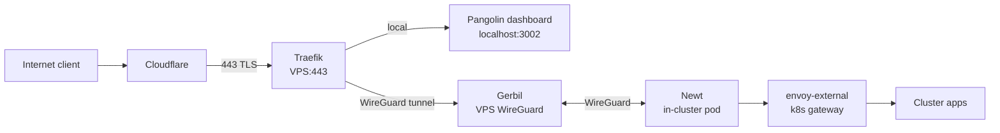
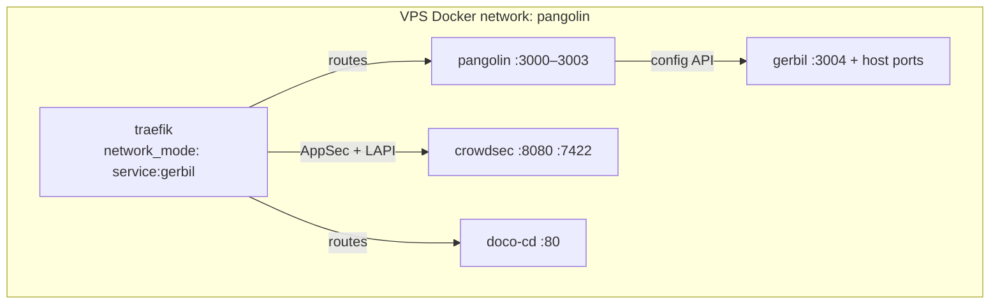

# VPS

A single Ubuntu VPS (`198.23.244.18`, `vps.internal`) acting as the public
ingress gateway for the home-ops cluster and host for the UniFi Network
Application. Everything here is deployed and kept in sync by
[doco-cd](https://github.com/kimdre/doco-cd) — a GitOps pull agent that runs
on the VPS itself and reconciles each stack against this repo on a 1-hour
poll cycle.

## Architecture

External traffic enters through Cloudflare, which proxies to the VPS on
port 443. Traefik (sharing Gerbil's network namespace) terminates TLS and
either serves VPS-local services directly or routes requests through the
Pangolin/Gerbil WireGuard tunnel to the in-cluster `envoy-external` gateway.



Gerbil owns the host network ports (`80`, `443`, `4443`, `51820/udp`,
`21820/udp`, `22`). Traefik runs with `network_mode: service:gerbil` — it
shares Gerbil's network namespace entirely and inherits all port bindings.
Pangolin drives Gerbil via its internal API (`localhost:3001`) and the
Kubernetes-side `pangolin-operator` manages `NewtSite` and `PublicResource`
CRDs that tell Pangolin about cluster services.



## Stacks

All stacks join the external `pangolin` Docker network so containers can
resolve each other by name regardless of which compose project they belong to.

| #   | Directory           | Services                                         | Data path        |
| --- | ------------------- | ------------------------------------------------ | ---------------- |
| 01  | `01-pangolin/`      | pangolin, gerbil, traefik, crowdsec, geoipupdate | `/opt/pangolin/` |
| 02  | `02-unifi/`         | unifi-network-application, unifi-db (mongo)      | `/opt/unifi/`    |
| 03  | `03-observability/` | node-exporter, fluent-bit, prometheus-agent      | —                |
| 04  | `04-unfbkup/`       | restic (UniFi → B2), ofelia (scheduler)          | —                |

## GitOps — doco-cd

[`.doco-cd.yaml`](.doco-cd.yaml) is the doco-cd configuration. It tells the
agent to pull `https://github.com/tscibilia/home-ops.git` (main) every hour
and apply every `docker-compose.yaml` found under `docker/vps/`. Secrets are
injected at deploy time by the aKeyless HTTP proxy running alongside doco-cd
(see [`.doco-cd/proxy.py`](.doco-cd/proxy.py)).

The agent also reconciles on `unhealthy` and `die` container events — a
crashed container triggers an immediate re-apply without waiting for the
hourly poll.

> [!IMPORTANT]
> doco-cd has **no force-deploy API or webhook** configured. The only way to
> trigger an immediate reconcile outside of a container event is to cause a
> container failure (e.g. `docker stop <name>`) or wait up to 60 minutes for
> the next poll. The doco-cd dashboard is available at
> `https://doco.tun.<DOMAIN>`.

## Secrets

All secrets are stored as individual text-based static secrets in aKeyless
(not JSON objects — the proxy extracts them by key and the wrong format
causes silent misparse). See [`.doco-cd.yaml`](.doco-cd.yaml) for the full
mapping. Key paths:

| Secret                     | aKeyless path                                                     |
| -------------------------- | ----------------------------------------------------------------- |
| Pangolin server secret     | `docker/vps-pangolin/secret-domain`                               |
| Cloudflare DNS token       | `docker/vps-cloudflare/dns-token`                                 |
| CrowdSec ↔ Traefik API key | `docker/vps-pangolin/crowdsec-traefik-api-key`                    |
| Home IP CIDR (allowlist)   | `docker/vps-pangolin/home-ip-cidr`                                |
| MaxMind account/license    | `docker/vps-maxmind/account-id`, `docker/vps-maxmind/license-key` |
| Primary domain             | `docker/secret-domain`                                            |
| CE app domain              | `docker/secret-ceapp-domain`                                      |
| UniFi Mongo credentials    | `docker/vps-unifi/mongo-*`                                        |
| UniFi restic/B2 backup     | `docker/vps-unifi/restic-*`, `docker/vps-unifi/b2-*`              |

## SSH access

```
ssh -i ~/.ssh/home-ops -p 22222 ubuntu@vps.internal
```

Port 22222 is the host sshd port. Port 22 on the public interface is owned
by Gerbil (forwarded through the Pangolin tunnel for SSH proxying to internal
services). Both cannot be active simultaneously on the same address.

> [!WARNING]
> Ubuntu uses **systemd socket activation** (`ssh.socket`) for sshd. The
> `Port` directive in `/etc/ssh/sshd_config` is ignored — the socket unit
> controls which port sshd listens on. `systemctl restart ssh` does **not**
> rebind the port. See [Troubleshooting](#sshd-reverts-to-port-22-after-reboot)
> to fix it.

## Troubleshooting

### Pangolin operator errors: `connection refused` on 443

**Symptom:** `kubectl logs -n network -l app.kubernetes.io/name=pangolin-operator`
shows repeated `dial tcp 198.23.244.18:443: connect: connection refused`.

**Cause:** Gerbil and/or Traefik are not running with their host port
bindings. This typically happens after a VPS reboot — see
[Gerbil/Traefik lose ports after reboot](#gerbilttraefik-lose-ports-and-network-after-reboot).

**Verify:**

```bash
ssh -i ~/.ssh/home-ops -p 22222 ubuntu@vps.internal \
  'ss -tlnp | grep -E "443|80"; docker ps | grep -E "gerbil|traefik"'
```

Port 443 should be listed and both containers should show port mappings in
`docker ps`. If mappings are absent the containers need to be recreated.

---

### Gerbil/Traefik lose ports and network after reboot

**Symptom:** All containers show `Up` in `docker ps` but Gerbil has no port
mappings and `docker inspect gerbil --format "{{json .NetworkSettings.Networks}}"` returns `{}`.

**Root cause:** On VPS reboot, sshd reverts to port 22 (socket activation
default). Docker then tries to restart Gerbil with `22:22` mapped — that
binding fails because sshd already holds port 22 — and Gerbil starts in a
degraded state: no port bindings and not connected to the `pangolin` network.
Traefik (sharing Gerbil's netns via `network_mode: service:gerbil`) inherits
the broken state.

**Fix:**

1. Resolve the sshd port conflict first — see
   [sshd reverts to port 22](#sshd-reverts-to-port-22-after-reboot).

2. Once sshd is on 22222 and port 22 is free, stop and remove the broken
   containers (requires SSH on port 22222 or VNC):

    ```bash
    docker stop traefik gerbil && docker rm traefik gerbil
    ```

3. doco-cd will recreate both containers on its next poll (≤ 60 min) or
   immediately if it detects the `die` event. To force it now, trigger a
   reconcile by restarting doco-cd:

    ```bash
    docker restart doco-cd
    ```

> [!NOTE]
> If you need Gerbil running immediately and cannot wait for doco-cd, you can
> recreate it manually. Traefik's config files live at
> `01-pangolin/config/traefik/` in this repo and can be `scp`'d to the VPS.
> See the full `docker run` commands in the session notes.

---

### sshd reverts to port 22 after reboot

**Symptom:** `ssh -p 22222 ubuntu@vps.internal` times out; port 22 answers
instead. `systemctl restart ssh` does not fix it.

**Cause:** Ubuntu uses `ssh.socket` for socket-based activation. The socket
unit binds the port, not sshd itself — so `Port 22222` in `sshd_config` is
ignored until socket activation is reconfigured.

**Fix (requires root in VNC or a working sudo session):**

```bash
# Override the socket unit to listen on 22222 instead of 22
systemctl edit ssh.socket
```

Add the following and save:

```ini
[Socket]
ListenStream=
ListenStream=22222
```

Then apply:

```bash
systemctl daemon-reload
systemctl restart ssh.socket
```

Verify port 22222 is now listening before closing the VNC session:

```bash
ss -tlnp | grep 22222
```

> [!TIP]
> Adding `ListenStream=` (empty) before the new value is required — it clears
> the inherited default of `22` from the base unit. Without it, sshd listens
> on **both** ports, blocking Gerbil from binding `22:22`.

---

### Cannot SSH to VPS (all ports refused)

If both port 22 and 22222 are unreachable, use the VPS provider's VNC/console
(RackNerd control panel). Once logged in as root:

1. Check sshd is running: `systemctl status ssh`
2. Check which ports are listening: `ss -tlnp | grep ssh`
3. Fix the socket unit as described above
4. Check that Gerbil hasn't bound port 22 already:
   `docker inspect gerbil --format "{{json .HostConfig.PortBindings}}"`

---

### NewtSite shows OFFLINE in k8s

```bash
kubectl get newtsite -A
```

If `ONLINE` is `false`:

1. Check Gerbil logs on the VPS for WireGuard peer errors:
   `docker logs --tail 50 gerbil`
2. Check the in-cluster Newt pod logs:
   `kubectl logs -n network -l app.kubernetes.io/instance=k8s-cluster`
3. Ensure the WireGuard UDP ports are reachable from the cluster egress IP:
   `nc -zuv vps.internal 51820`

The NewtSite reports `Ready` even when `ONLINE=true` is intermittent — check
Gerbil logs for `no recent ping` messages which indicate the newt client has
disconnected.

---

### CrowdSec blocking legitimate traffic

Check the CrowdSec decision list:

```bash
ssh -i ~/.ssh/home-ops -p 22222 ubuntu@vps.internal \
  'docker exec crowdsec cscli decisions list'
```

To remove a specific IP:

```bash
docker exec crowdsec cscli decisions delete --ip <ip>
```

The home IP CIDR is whitelisted via the `custom/home-allowlist` parser
(sourced from `docker/vps-pangolin/home-ip-cidr` in aKeyless). If your home
IP has changed, update that secret and let doco-cd reconcile.
