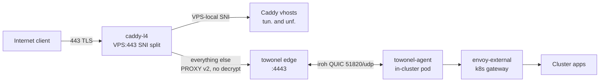
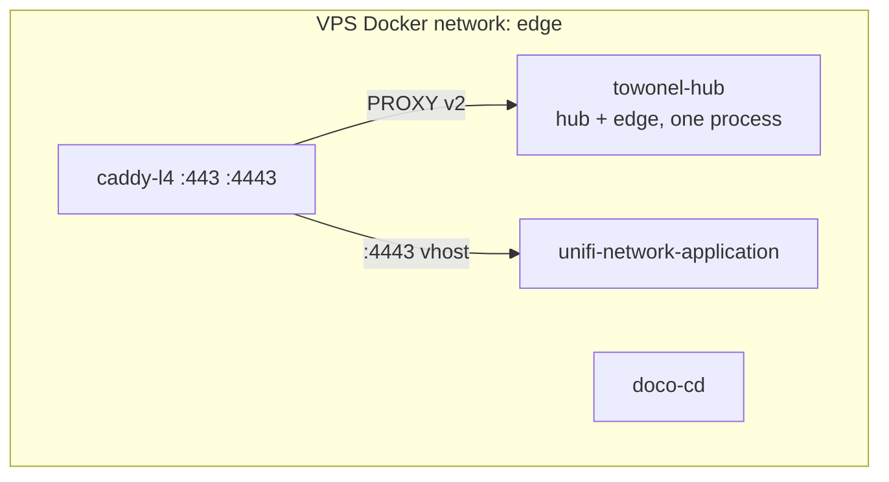

# VPS

A single Ubuntu VPS (`198.23.244.18`, `vps.internal`) acting as the public
ingress gateway for the home-ops cluster and host for the UniFi Network
Application. Everything here is deployed and kept in sync by
[doco-cd](https://github.com/kimdre/doco-cd) — a GitOps pull agent that runs
on the VPS itself and reconciles each stack against this repo on a 1-hour
poll cycle.

## Architecture

DNS for the public hostnames is **DNS-only** (not Cloudflare-proxied), so
clients connect straight to the VPS on port 443. `caddy-l4` owns that port and
splits traffic by TLS SNI without decrypting it: VPS-local hostnames terminate
at Caddy, everything else is forwarded raw to the towonel edge. TLS therefore
terminates at the in-cluster gateway, not here.



`caddy-l4` owns `443` and `4443`. `towonel-hub` owns `51820/udp` and publishes
its hub and edge metrics on loopback only. The UniFi container publishes its own
device ports (`8080`, `8843`, `6789`, `3478/udp`, `10001/udp`) directly.

The towonel binary runs the hub (control plane) and the edge (data plane) in one
process. The agent **dials out** from the cluster, so no inbound port is needed
on the cluster side.



## Stacks

All stacks join the external `edge` Docker network so containers can resolve
each other by name regardless of which compose project they belong to. Unlike
the network it replaced, `edge` is provisioned by Ansible
(`ansible/vps/playbook.yaml`, tag `network`) rather than by a stack — so it
survives any stack being removed.

Directories are numbered by dependency order — `caddy-l4` owns `:443` and must
come up first, and `towonel` is the tunnel it feeds. `03` is reserved for
`crowdsec`.

| #   | Directory           | Services                                    | Data path       |
| --- | ------------------- | ------------------------------------------- | --------------- |
| 01  | `01-caddy-l4/`      | caddy-l4 (SNI splitter, UniFi vhost)        | —               |
| 02  | `02-towonel/`       | towonel-node (hub + edge)                   | `/opt/towonel/` |
| 04  | `04-unifi/`         | unifi-network-application, unifi-db (mongo) | `/opt/unifi/`   |
| 05  | `05-observability/` | node-exporter, fluent-bit, prometheus-agent | —               |
| 06  | `06-unfbkup/`       | restic (UniFi → B2), ofelia (scheduler)     | —               |

## GitOps — doco-cd

[`.doco-cd.yaml`](.doco-cd.yaml) is the doco-cd configuration. It tells the
agent to pull `https://github.com/tscibilia/home-ops.git` (main) every hour
and apply every `docker-compose.yaml` found under `docker/vps/`. Secrets are
injected at deploy time by the aKeyless HTTP proxy running alongside doco-cd
(see [`.doco-cd/proxy.py`](.doco-cd/proxy.py)).

The agent also reconciles on `unhealthy` and `die` container events — a
crashed container triggers an immediate re-apply without waiting for the
hourly poll.

> [!IMPORTANT]
> doco-cd has **no force-deploy API or webhook** configured. To trigger an
> immediate reconcile, restart the agent with `docker restart doco-cd`;
> otherwise wait up to 60 minutes for the next poll.

> [!NOTE]
> Reconciliation on `die` events means a manual `docker compose down` of a stack
> that is still present in git will be undone — doco-cd brings it straight back.
> To remove a stack for good, delete its directory from this repo and let
> `auto_discovery.delete` tear it down.

> [!WARNING]
> doco-cd's own stack lives at `/opt/doco-cd` and is **not** managed by doco-cd
> (it cannot manage itself). It is installed by Ansible and refreshed nightly by
> [`.doco-cd/cron-update.sh`](.doco-cd/cron-update.sh), which pulls its compose
> file from `main` and force-recreates on any change. Edits to
> `.doco-cd/docker-compose.app.yaml` therefore apply unattended — make sure any
> prerequisite (such as a Docker network it references) exists on the host first.

## Secrets

All secrets are stored as individual text-based static secrets in aKeyless
(not JSON objects — the proxy extracts them by key and the wrong format
causes silent misparse). See [`.doco-cd.yaml`](.doco-cd.yaml) for the full
mapping. Key paths:

| Secret                   | aKeyless path                                                |
| ------------------------ | ------------------------------------------------------------ |
| towonel hub identity/KEK | `docker/vps-towonel/identity-key`, `.../hub-kek`             |
| towonel invite/operator  | `docker/vps-towonel/invite-hash-key`, `.../operator-api-key` |
| towonel hub link PSK     | `docker/vps-towonel/hub-link-psk`                            |
| towonel hub hostname     | `docker/vps-towonel/hub-hostname`                            |
| Caddy ACME email         | `docker/vps-towonel/acme-email`                              |
| UniFi hostname (vhost)   | `docker/vps-unifi/hostname`                                  |
| Primary domain           | `docker/secret-domain`                                       |
| Prometheus remote-write  | `docker/vps-prometheus/username`, `.../password`             |
| UniFi Mongo credentials  | `docker/vps-unifi/mongo-*`                                   |
| UniFi restic/B2 backup   | `docker/vps-unifi/restic-*`, `docker/vps-unifi/b2-*`         |

## SSH access

```
ssh -i ~/.ssh/home-ops -p 22222 ubuntu@vps.internal
```

Port 22222 is the host sshd port. Port 22 is unused and closed in ufw — the
tunnel that used to forward it is gone.

> [!WARNING]
> Ubuntu uses **systemd socket activation** (`ssh.socket`) for sshd. The
> `Port` directive in `/etc/ssh/sshd_config` is ignored — the socket unit
> controls which port sshd listens on. `systemctl restart ssh` does **not**
> rebind the port. See [Troubleshooting](#sshd-reverts-to-port-22-after-reboot)
> to fix it.

## Troubleshooting

### sshd reverts to port 22 after reboot

**Symptom:** `ssh -p 22222 ubuntu@vps.internal` times out; port 22 answers
instead. `systemctl restart ssh` does not fix it.

**Cause:** Ubuntu uses `ssh.socket` for socket-based activation. The socket
unit binds the port, not sshd itself — so `Port 22222` in `sshd_config` is
ignored until socket activation is reconfigured.

**Fix (requires root in VNC or a working sudo session):**

```bash
# Override the socket unit to listen on 22222 instead of 22
systemctl edit ssh.socket
```

Add the following and save:

```ini
[Socket]
ListenStream=
ListenStream=22222
```

Then apply:

```bash
systemctl daemon-reload
systemctl restart ssh.socket
```

Verify port 22222 is now listening before closing the VNC session:

```bash
ss -tlnp | grep 22222
```

> [!TIP]
> Adding `ListenStream=` (empty) before the new value is required — it clears
> the inherited default of `22` from the base unit. Without it, sshd listens
> on **both** ports.

---

### Cannot SSH to VPS (all ports refused)

If both port 22 and 22222 are unreachable, use the VPS provider's VNC/console
(RackNerd control panel). Once logged in as root:

1. Check sshd is running: `systemctl status ssh`
2. Check which ports are listening: `ss -tlnp | grep ssh`
3. Fix the socket unit as described above
