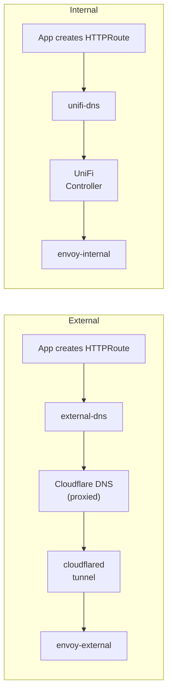

# Network

Namespace: `network`

| App            | Notes                                                  |
| -------------- | ------------------------------------------------------ |
| envoy-gateway  | Two gateway instances: envoy-external + envoy-internal |
| cloudflared    | Cloudflare tunnel for external access (*.t0m.co)       |
| external-dns   | Syncs envoy-external HTTPRoutes → Cloudflare DNS       |
| unifi-dns      | Syncs HTTPRoutes → UniFi controller for LAN resolution |
| multus         | CNI for secondary network interfaces (VPN VLAN)        |
| tailscale      | Mesh VPN access to the cluster                         |
| certificates   | Shared TLS certificate resources                       |
| echo           | Test endpoint for debugging ingress, external access   |

## Config Notes

??? note "Envoy Gateway"
    The ingress layer. Two separate gateway instances handle different traffic:

    - **envoy-external**: Internet-facing. Cloudflared terminates the Cloudflare tunnel and forwards to this gateway. All `*.t0m.co` traffic enters here.
    - **envoy-internal**: LAN-only. UniFi DNS points LAN clients directly to this gateway's LoadBalancer IP.

    Apps attach to one or both gateways via HTTPRoute resources. Authentication is handled by SecurityPolicy resources that forward to the Authentik outpost.

??? note "Multus"
    Provides secondary network interfaces for pods that need direct LAN or VLAN access. Currently used by qBittorrent (VPN VLAN 99), Home Assistant, and ESPHome (LAN device discovery).

### DNS Flow

