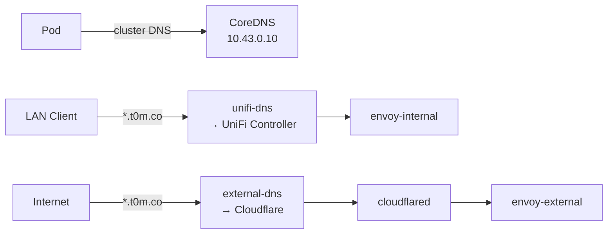

# Architecture

## Hardware

Three Lenovo ThinkCentre M70q Tiny (Gen 3) running Talos Linux.

| Node  | Mgmt IP        | Ceph IP        |
| ----- | -------------- | -------------- |
| k8s-1 | 192.168.5.211  | 192.168.43.11  |
| k8s-2 | 192.168.5.212  | 192.168.43.12  |
| k8s-3 | 192.168.5.213  | 192.168.43.13  |

- **VIP**: 192.168.5.210:6443
- **GPU**: Intel i915 iGPU on all nodes — Plex and Jellyfin use it for hardware transcoding
- **OS configs**: Minijinja templates in `kubernetes/talos/`, never edit rendered output directly

## Networking

### Physical

- **UDM-Pro** (192.168.5.1): router, firewall, DNS controller
- **Primary LAN**: 192.168.5.0/24 — management and cluster traffic
- **Ceph network**: 192.168.43.0/24 — dedicated 2.5GbE for storage replication
- **VPN VLAN**: 192.168.99.0/24 — VLAN 99 via Multus for qBittorrent

### LAN DNS

UniFi controller manages the `.internal` domain for non-cluster hosts:

- truenas.internal, unraid.internal, ai3090.internal — static entries in UniFi
- The `unifi-dns` pod syncs cluster HTTPRoutes into UniFi so LAN clients resolve cluster services without touching Cloudflare

### Cluster

!!! warning "No kube-proxy"
    Cilium is the eBPF replacement. Standard kube-proxy debug tools don't apply. Use `cilium` CLI or Hubble for network debugging.

- **CNI**: Cilium — eBPF-based, completely replaces kube-proxy
- **Load balancing**: Cilium L2 ARP announcements, IP pool 192.168.5.200–250
- **Routing**: HTTPRoute resources, not legacy Ingress objects
- **Auth**: Authentik SSO via Envoy SecurityPolicy forward-auth
- **Cross-namespace**: Requires a ReferenceGrant when an HTTPRoute or SecurityPolicy references a Service in another namespace

**Ingress** — Envoy Gateway runs two instances:

=== "envoy-external"

    Internet-facing. Cloudflared terminates the Cloudflare tunnel and forwards traffic here. All `*.t0m.co` requests enter through this gateway.

=== "envoy-internal"

    LAN-only. UniFi DNS points local clients directly to this gateway's LoadBalancer IP. No Cloudflare involvement.

### DNS

Three layers of resolution:

| Layer        | Service      | Scope                                      |
| ------------ | ------------ | ------------------------------------------ |
| In-cluster   | CoreDNS      | Pod-to-pod, service discovery (10.43.0.10) |
| LAN          | unifi-dns    | Syncs HTTPRoutes → UniFi controller        |
| External     | external-dns | Syncs envoy-external routes → Cloudflare (proxied) |

### Certificates

cert-manager handles TLS via Let's Encrypt with DNS-01 challenges through Cloudflare API.

## Storage

| Class             | Backend                  | Use                                        |
| ----------------- | ------------------------ | ------------------------------------------ |
| ceph-ssd (default)| Rook-Ceph, Samsung SSDs  | All persistent workloads                   |
| openebs-hostpath  | Local node storage       | CNPG clusters, victoria-logs, actions-runner |
| nfs-media         | TrueNAS NFS              | Media libraries                            |

!!! info "No ceph-rbd, no CephFS, no object storage"

### Backups

- **VolSync**: Restic-based PVC snapshots → Backblaze B2
- **CNPG**: Barman-cloud WAL archiving + base backups → Backblaze B2

## Databases

### PostgreSQL (CNPG)

!!! warning "Two clusters — don't mix them up"
    They use different images. `pgsql-cluster` is standard PostgreSQL 17. `immich17` has the vectorchord extension for vector search.

| Cluster       | Image                              | Use                                |
| ------------- | ---------------------------------- | ---------------------------------- |
| pgsql-cluster | cloudnative-pg/postgresql:17       | General apps (Authentik, Gatus, Homebox, Mealie, etc.) |
| immich17      | tensorchord/cloudnative-vectorchord:17 | Immich (vector search)         |

Read-write endpoint: `<cluster>-rw.database.svc.cluster.local`

Apps declare `dependsOn: [{name: cnpg-cluster, namespace: database}]` in their `ks.yaml`.

### Cache

Dragonfly (Redis-compatible) at `dragonfly-cluster.database.svc.cluster.local:6379`:

| DB  | Consumer |
| --- | -------- |
| 0   | Default  |
| 2   | Immich   |
| 3   | Searxng  |

## Secrets

All secrets live in aKeyless and sync into the cluster via ExternalSecret CRDs. Cluster-wide variables are injected through `postBuild.substituteFrom: cluster-secrets` in each app's `ks.yaml`.

## GitOps

Flux CD watches this repo and reconciles on every push.

- **Entry point**: `ks.yaml` per app — defines `dependsOn`, `postBuild` substitutions, and `components`
- **Components**: Reusable patterns in `kubernetes/components/` — volsync, cnpg, ext-auth-internal, ext-auth-external, keda

!!! danger "kubectl edits are ephemeral"
    Flux resets them on the next reconciliation. Always edit in Git, push, and reconcile.
