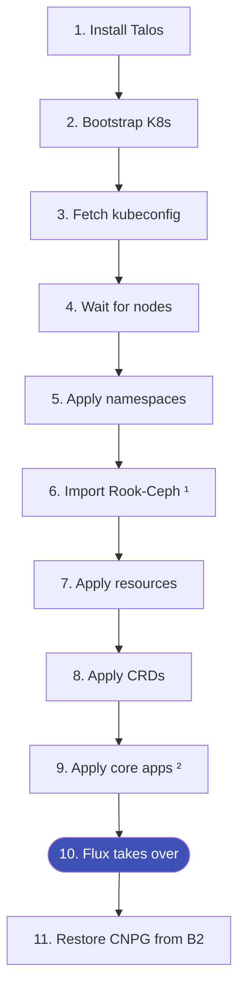

# Bootstrap

Full cluster rebuild from zero. You need this repo, aKeyless access, and Backblaze B2 credentials.

## Prerequisites

- Three nodes on the network with Talos ISO booted
- `mise` installed locally with all tools activated (`just`, `talosctl`, `kubectl`, `flux`, `helm`)
- aKeyless credentials available
- Backblaze B2 credentials for CNPG database recovery

## Stage Order



<small>¹ Only if restoring an existing cluster &nbsp; ² Cilium → CoreDNS → cert-manager → external-secrets</small>

| Stage | Command | Notes |
| ----- | ------- | ----- |
| 1. Install Talos | `just bootstrap talos` | |
| 2. Bootstrap K8s | `just bootstrap kube` | |
| 3. Fetch kubeconfig | `just bootstrap kubeconfig` | |
| 4. Wait for nodes | `just bootstrap wait` | |
| 5. Apply namespaces | `just bootstrap namespaces` | |
| 6. Import Rook-Ceph | `just bootstrap rook-ceph-external` | Only if restoring |
| 7. Apply resources | `just bootstrap resources` | |
| 8. Apply CRDs | `just bootstrap crds` | |
| 9. Apply core apps | `just bootstrap apps` | Cilium → CoreDNS → cert-manager → external-secrets |
| 10. Flux takes over | — | Reconciles everything else from Git |
| 11. Restore databases | `just bootstrap cnpg` | Recovers CNPG clusters from B2 backups |

## Post-Bootstrap Checks

```bash
# Ceph cluster healthy
kubectl get cephcluster -n rook-ceph

# All Kustomizations ready
kubectl get ks -A | grep -v True

# DNS resolving
dig @10.43.0.10 kubernetes.default.svc.cluster.local

# Cloudflared tunnel running
kubectl get pods -n network -l app=cloudflared

# CNPG clusters healthy
kubectl get cluster -n database
```

## Restoring VolSync Backups

For apps with PVC data (config, state — not databases):

```bash
just kube volsync-restore <ns> <name> <previous>
```

This handles the full flow: suspend the app → delete the existing PVC → VolSync Volume Populator creates a new PVC from the backup → resume the app.

Check available snapshots first: `just kube volsync-list <ns> <name>`

## Important Notes

!!! warning "Upgrade order matters"
    Always upgrade Talos first (`just talos upgrade-node <node>`), then Kubernetes (`just talos upgrade-k8s <version>`). Never the other way around.

!!! danger "Don't manually recreate CNPG clusters"
    CNPG recovery uses Barman-cloud backups from B2. Use `just bootstrap cnpg` — it handles the restore process.

- **Talos configs are templates** — edit `kubernetes/talos/`, never the rendered output
- **Flux is the source of truth** — once it's running, everything else deploys from Git automatically
