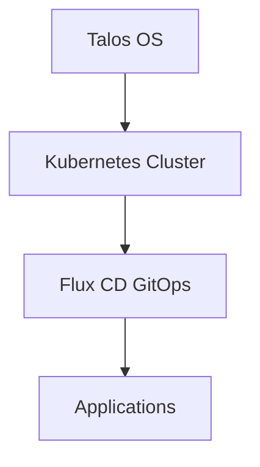

# Home Operations

Welcome to the home-ops documentation! This is a Kubernetes-based home infrastructure that runs everything from media streaming to home automation, all managed through GitOps principles.

## What is this?

Think of this as your home datacenter, but instead of buying expensive enterprise equipment, it runs on a cluster of machines using Kubernetes. Every service you interact with—media servers, file storage, authentication—lives here and is managed through code that lives in Git.

If something breaks, you can trace back through Git history. If you want to add something new, you write some YAML, push it to GitHub, and the cluster automatically deploys it. No clicking through web UIs, no forgetting what configuration you changed six months ago.

## Quick Navigation

-   :material-rocket-launch:{ .lg .middle } **Getting Started**

    ---

    New to the cluster? Start here to understand how everything fits together.

    [:octicons-arrow-right-24: Getting Started](guides/getting-started.md)

-   :material-server:{ .lg .middle } **Infrastructure**

    ---

    Learn about Talos OS, the bootstrap process, and how the cluster is set up from scratch.

    [:octicons-arrow-right-24: Infrastructure Guide](infrastructure/overview.md)

-   :material-kubernetes:{ .lg .middle } **Kubernetes Layer**

    ---

    Dive into how applications are structured, deployed, and managed with Flux CD.

    [:octicons-arrow-right-24: Kubernetes Guide](kubernetes/overview.md)

-   :material-wrench:{ .lg .middle } **Operations**

    ---

    Day-to-day operations: troubleshooting, maintenance, backups, and monitoring.

    [:octicons-arrow-right-24: Operations Guide](operations/overview.md)

## Architecture at a Glance

The infrastructure is split into three main layers:

1. **Talos OS**: The foundation—an immutable Linux distribution built specifically for Kubernetes
2. **Kubernetes**: The orchestration layer that runs containers across multiple nodes
3. **Flux CD**: Watches the Git repository and automatically applies changes to the cluster
4. **Applications**: Everything from media servers to databases, all deployed through Helm charts

## Why GitOps?

Traditional server management involves SSH-ing into machines, editing config files, restarting services, and hoping you remember what you changed. GitOps flips this model:

- **Single source of truth**: Everything is defined in this Git repository
- **Automatic deployment**: Push to Git, the cluster updates itself
- **Rollback friendly**: Broke something? Revert the Git commit
- **Audit trail**: Want to know when that database was upgraded? Check the Git log

## Current Stack

Here's what's running in the cluster:

=== "Media"
    - **Plex/Jellyfin**: Media streaming
    - **Sonarr/Radarr**: TV and movie automation
    - **Prowlarr**: Indexer management
    - **qBittorrent**: Downloads
    - **Bazarr/Tautulli**: Subtitles and monitoring

=== "Databases"
    - **PostgreSQL (CNPG)**: Primary database cluster
    - **Dragonfly**: Redis-compatible cache
    - **pgAdmin**: Database management UI

=== "Core Services"
    - **Authentik**: Single Sign-On (SSO) for all services
    - **Vaultwarden**: Password manager
    - **Immich**: Photo management
    - **Mealie**: Recipe management

=== "Infrastructure"
    - **Cilium**: Kubernetes CNI with eBPF
    - **Rook-Ceph**: Distributed storage
    - **Envoy Gateway**: Ingress and routing
    - **Cloudflared**: Cloudflare tunnel for external access
    - **cert-manager**: TLS certificate automation

=== "Observability"
    - **VictoriaMetrics**: Time-series metrics
    - **Grafana**: Dashboards and visualization
    - **Gatus**: Status page and uptime monitoring
    - **Fluent-bit**: Log aggregation

## Key Features

- **Automated backups**: VolSync handles backups to cloud storage
- **Auto-scaling**: KEDA scales apps based on load and events
- **SSO everywhere**: Authentik provides login for protected services
- **Zero-trust networking**: Cloudflare tunnel with Envoy Gateway
- **Automatic updates**: Renovate bot creates PRs for dependency updates

## Need Help?

- Check the [Troubleshooting Guide](operations/troubleshooting.md) for common issues
- Browse the [Operations](operations/overview.md) section for maintenance procedures
- Refer to the [Task Runner Reference](operations/task-runner.md) for command usage

??? info "External Resources"
    - [DeepWiki AI Documentation](https://deepwiki.com/tscibilia/home-ops) - AI-generated documentation
    - [GitHub Repository](https://github.com/tscibilia/home-ops) - Source code
    - [Flux CD Documentation](https://fluxcd.io/docs/) - GitOps toolkit
    - [Talos Documentation](https://www.talos.dev/latest/) - Talos OS guides
