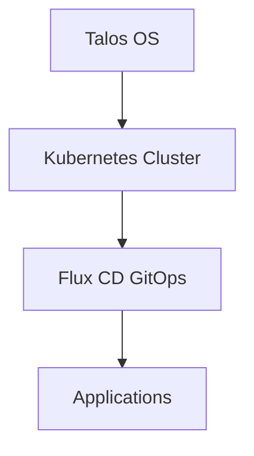

# Home Operations

This repository holds a GitOps-managed Kubernetes home infrastructure (Talos OS → Kubernetes → Flux). The docs are a compact reference for how the pieces fit together and where to look when something breaks.

## Quick Navigation

<div class="grid cards" markdown>

-   :material-rocket-launch:{ .lg .middle } **Getting Started**

	---

	New to the cluster? Start here.

	[:octicons-arrow-right-24: Getting Started](guides/getting-started.md)

-   :material-server:{ .lg .middle } **Infrastructure**

	---

	Talos, bootstrapping, and node configuration.

	[:octicons-arrow-right-24: Infrastructure Guide](infrastructure/overview.md)

-   :material-kubernetes:{ .lg .middle } **Kubernetes Layer**

	---

	Apps, Flux, and deployment patterns.

	[:octicons-arrow-right-24: Kubernetes Guide](kubernetes/overview.md)

-   :material-wrench:{ .lg .middle } **Operations**

	---

	Troubleshooting, backups, and maintenance.

	[:octicons-arrow-right-24: Operations Guide](operations/overview.md)

</div>

## Architecture at a glance



Use the repository as the source of truth: push changes to Git, then reconcile with Flux. For design details and templates, see the `talos/` and `bootstrap/` folders.

## What's in the cluster

- Media & automation: Plex/Jellyfin, Sonarr, Radarr, Prowlarr, qBittorrent
- Databases: CNPG (Postgres), Dragonfly (Redis-compatible cache)
- Core infra: Cilium, Rook-Ceph, Envoy Gateway, Cloudflared, cert-manager
- Observability: VictoriaMetrics, Grafana, Fluent-bit, Gatus

## Key practices

- GitOps: repo is the single source of truth; use Flux for reconciliation
- Backups: VolSync + Restic for critical PVCs
- Secrets: managed with ExternalSecrets (aKeyless) and `cluster-secrets`
- Access: Authentik provides SSO; external access via Cloudflared + Envoy

## Need help?

- Troubleshooting: [operations/troubleshooting.md](operations/troubleshooting.md)
- Task runner commands: [operations/task-runner.md](operations/task-runner.md)
- Repo: https://github.com/tscibilia/home-ops

??? info "External Resources"
	- [DeepWiki AI Documentation](https://deepwiki.com/tscibilia/home-ops)
	- [GitHub Repository](https://github.com/tscibilia/home-ops)
	- [Flux CD Documentation](https://fluxcd.io/docs/)
	- [Talos Documentation](https://www.talos.dev/latest/)

```
