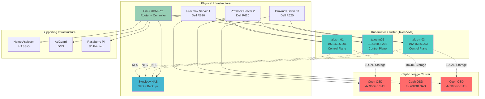
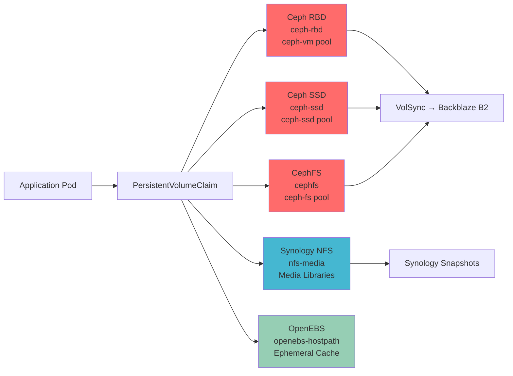
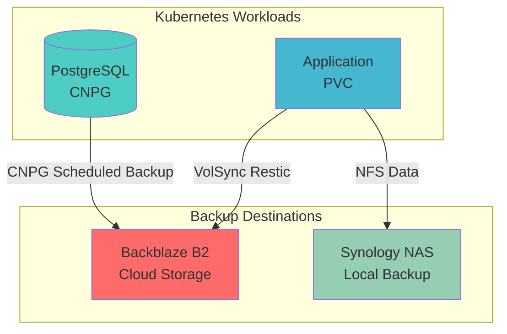

# Infrastructure Architecture

This document describes the complete home infrastructure, including the Kubernetes cluster, storage systems, networking equipment, and how everything interconnects.

## High-Level Architecture

The infrastructure is built on a foundation of **Proxmox virtualization** running Kubernetes (via Talos OS), supported by external **Ceph storage**, **Synology NAS**, and **UniFi networking**.



---

## Physical Hardware

### Proxmox Cluster (3x Dell R620)

**Purpose**: Hypervisor layer hosting Talos Kubernetes VMs and external Ceph storage cluster

**Specifications**:
- **Servers**: 3x Dell PowerEdge R620 rack servers
- **Network**: Dell 10GbE dual-port cards in mesh configuration
- **Storage**: 4x 900GB 10k SAS drives per server (dedicated to Ceph OSDs)
- **Ceph Configuration**: Hyper-converged setup (compute + storage on same physical hardware)

**What runs here**:
- Ceph storage cluster (distributed block + filesystem storage)
- Talos Kubernetes nodes as VMs
- External Ceph cluster provides storage back to Kubernetes via Rook-Ceph

??? info "Why External Ceph?"
    The cluster follows [onedr0p's external Ceph architecture](https://onedr0p.github.io/home-ops/archive/proxmox-considerations.html), separating Ceph management from Kubernetes. This provides:

    - **Cluster survivability**: Storage persists even if Kubernetes cluster is destroyed
    - **Simplified disaster recovery**: Rebuild Kubernetes VMs without touching storage
    - **Performance isolation**: Ceph operations don't compete with Kubernetes workloads
    - **Independent scaling**: Add storage capacity without adding Kubernetes nodes

    See [Rook-Ceph README](https://github.com/tscibilia/home-ops/blob/main/kubernetes/apps/rook-ceph/rook-ceph/README.md) for implementation details.

### Kubernetes Cluster (Talos VMs)

**Purpose**: Container orchestration platform running all applications

**Node Configuration**:

| Node | Management IP | Ceph IP | Role | Special Features |
|------|--------------|---------|------|------------------|
| **talos-m01** | 192.168.5.201 | 10.10.10.8 | Control Plane | NVIDIA Quadro P400 GPU |
| **talos-m02** | 192.168.5.202 | 10.10.10.9 | Control Plane | Standard node |
| **talos-m03** | 192.168.5.203 | 10.10.10.10 | Control Plane | Standard node |

**VIP**: 192.168.5.200 (Cilium LoadBalancer shared IP for API access)

**Operating System**: [Talos Linux](https://talos.dev) - Immutable Kubernetes OS
- No SSH access (API-driven management via `talosctl`)
- Declarative configuration via YAML templates
- Minimal attack surface (read-only root filesystem)
- Automatic OS updates via [tuppr](https://github.com/home-operations/tuppr)

**Dual Network Design**:
Each node has two network interfaces:
- **vmbr0** (192.168.5.x): Management network for Kubernetes API, pod networking, external access
- **vmbr1** (10.10.10.x): Dedicated Ceph storage network (10GbE mesh)

This segregation prevents storage traffic from impacting application performance.

---

## Storage Infrastructure

### Ceph Distributed Storage

**Purpose**: Persistent block and filesystem storage for Kubernetes workloads

**Architecture**: External Ceph cluster running on Proxmox, consumed by Kubernetes via Rook-Ceph

**Configuration**:
- **Public Network**: 10.10.10.0/28 (dedicated storage VLAN)
- **Pools**:
  - `ceph-vm`: Primary RBD block storage pool
  - `ceph-ssd`: Secondary RBD block storage pool
  - `ceph-fs`: CephFS filesystem pool (with `ceph-fs_data` and `ceph-fs_metadata`)
- **Replication**: 3x replication across nodes
- **Connection**: Kubernetes nodes connect via vmbr1 (10GbE)

**Storage Classes Provided**:

| Storage Class | Ceph Pool | Type | Use Case |
|--------------|-----------|------|----------|
| **ceph-rbd** | `ceph-vm` | RBD (block) | General-purpose block storage |
| **ceph-ssd** | `ceph-ssd` | RBD (block) | High-performance databases, application state |
| **cephfs** | `ceph-fs_data` | CephFS (filesystem) | Shared filesystem for multi-pod access |

**Integration**:
Kubernetes imports Ceph resources via `create-external-cluster-resources.py` script run on Proxmox, then `import-external-cluster.sh` configures Rook-Ceph operator to manage external cluster.

Configuration: [`kubernetes/apps/rook-ceph/`](https://github.com/tscibilia/home-ops/tree/main/kubernetes/apps/rook-ceph)

### Synology NAS

**Purpose**: Bulk file storage, NFS media shares, and backup destination

**Capabilities**:
- **NFS Server**: Exports shares consumed by Kubernetes (`nfs-media` storage class)
- **Backup Target**: Stores VolSync backups, CNPG database backups
- **Media Library**: Centralized storage for Plex, Jellyfin media files

**Integration**:
- Kubernetes CSI NFS driver mounts Synology shares: [`kubernetes/apps/kube-system/csi-driver-nfs/`](https://github.com/tscibilia/home-ops/tree/main/kubernetes/apps/kube-system/csi-driver-nfs)
- IP referenced as `${NAS_IP}` in cluster secrets
- Connected via home LAN (192.168.5.x)

---

## Network Infrastructure

### UniFi Network (UDM-Pro)

**Purpose**: Core network routing, switching, DNS, and Wi-Fi management

**Role**: UniFi Dream Machine Pro serves as:
- **Router**: Gateway for 192.168.5.0/24 LAN
- **DNS Server**: Primary DNS for internal devices (integrated with `unifi-dns`)
- **Controller**: Manages UniFi switches and access points
- **Firewall**: Network segmentation and security policies

**Integration with Kubernetes**:
- **unifi-dns**: External-DNS webhook provider syncs Kubernetes HTTPRoute DNS records to UniFi controller
  - Automatically creates/updates/deletes A records for services
  - Domain filter: `t0m.co`
  - Configuration: [`kubernetes/apps/network/unifi-dns/`](https://github.com/tscibilia/home-ops/tree/main/kubernetes/apps/network/unifi-dns)
- **unpoller**: Prometheus exporter scrapes UniFi metrics (bandwidth, clients, devices)
  - Grafana dashboards visualize network performance
  - Configuration: [`kubernetes/apps/observability/unpoller/`](https://github.com/tscibilia/home-ops/tree/main/kubernetes/apps/observability/unpoller)

**VLANs** (referenced in multus setup):
- Planning to add VLAN isolation for qBittorrent torrent traffic
- See [issue #1168](https://github.com/tscibilia/home-ops/issues/1168) for multus VLAN integration

### Network Topology

**Primary Network**: 192.168.5.0/24
- **Gateway**: UniFi UDM-Pro
- **Kubernetes Nodes**: 192.168.5.201-203
- **Kubernetes VIP**: 192.168.5.200
- **Synology NAS**: ${NAS_IP} (referenced in secrets)
- **Home Assistant**: ${HASSIO_IP}
- **AdGuard**: ${ADGUARD_IP}
- **Other devices**: Raspberry Pi (3D printing), additional NAS

**Ceph Storage Network**: 10.10.10.0/28
- **Ceph Monitors**: 10.10.10.1-3 (Proxmox nodes)
- **Talos Node Storage IPs**: 10.10.10.8-10
- **Purpose**: Dedicated 10GbE mesh for Ceph replication and client traffic

---

## Supporting Infrastructure

### Home Assistant

**Purpose**: Home automation platform

**Integration**: Runs independently but monitored by Kubernetes Gatus status page

**IP**: Referenced as `${HASSIO_IP}` in cluster secrets

### AdGuard

**Purpose**: Network-wide ad blocking and DNS filtering

**IP**: Referenced as `${ADGUARD_IP}` in cluster secrets

### Raspberry Pi (3D Printing)

**Purpose**: OctoPrint or similar 3D printer management

**IP**: Referenced as `${PI_3DP_IP}` in cluster secrets

---

## Data Flow Architecture

### Application Data Storage



**Storage Decision Matrix**:

| App Type | Storage Class | Ceph Pool | Reason |
|----------|--------------|-----------|---------|
| **Databases** (PostgreSQL, Redis) | `ceph-ssd` | `ceph-ssd` | Requires persistence, fast I/O, survives node failure |
| **Config files** (Home Assistant, etc.) | `ceph-ssd` | `ceph-ssd` | Small but critical data |
| **General storage** | `ceph-rbd` | `ceph-vm` | Standard persistent block storage |
| **Shared data** (multi-pod apps) | `cephfs` | `ceph-fs_data` | Multiple pods need simultaneous access |
| **Media libraries** (Plex, Jellyfin) | `nfs-media` | N/A (Synology) | Large capacity, served from Synology NAS |
| **Cache** (Victoria Logs, temp data) | `openebs-hostpath` | N/A (local) | Fast local storage, doesn't need persistence |

### Backup Strategy



**Backup Components**:
- **VolSync**: Automated PVC backups to Backblaze B2 (every 6 hours)
- **CNPG**: PostgreSQL database backups to B2 (scheduled via CronJob)
- **Synology**: NFS data naturally backed up to NAS snapshots

---

## External Services Integration

The infrastructure integrates with several cloud services:

| Service | Purpose | Usage |
|---------|---------|-------|
| **Cloudflare** | DNS + Tunnel | Zero Trust tunnel exposes services without port forwarding |
| **aKeyless** | Secrets Management | Central vault for all sensitive credentials |
| **Backblaze B2** | Backup Storage | VolSync and CNPG backups destination |
| **Pushover** | Notifications | AlertManager sends critical alerts to mobile |
| **Amazon SES** | Email Delivery | System emails (e.g., password resets) |
| **AirVPN** | VPN | Torrent traffic routing (qBittorrent pod) |

---

## Cluster Resilience

### Single Node Failure

**Impact**: Minimal
- Kubernetes reschedules pods to remaining 2 nodes
- Ceph continues serving data (3x replication across nodes)
- VIP automatically fails over to healthy control plane

**Recovery**: Automatic (pods migrate, Ceph rebalances)

### Two Node Failure

**Impact**: Cluster degraded but functional
- Kubernetes API remains accessible via remaining node
- Ceph enters read-only mode (requires quorum: 2/3 nodes)
- New pods cannot schedule (insufficient capacity)

**Recovery**: Manual (restore failed nodes or rebuild cluster from backup)

### Complete Cluster Loss

**Impact**: All Kubernetes workloads offline
- Ceph data remains intact on Proxmox storage
- Synology NAS data unaffected
- Backups available in Backblaze B2

**Recovery**: Full bootstrap process
1. Rebuild Talos VMs on Proxmox
2. Run `just bootstrap` to restore Kubernetes
3. Restore CNPG databases from B2 backups
4. Restore application PVCs via VolSync

See [Bootstrap Guide](bootstrap.md) for disaster recovery procedures.

---

## Performance Characteristics

### Storage Performance

| Storage Class | Ceph Pool | Latency | Throughput | Use Case |
|--------------|-----------|---------|------------|----------|
| `openebs-hostpath` | N/A (local) | <1ms | Local disk speed | Fastest (ephemeral) |
| `ceph-ssd` | `ceph-ssd` | 2-5ms | ~500 MB/s | Fast persistent storage |
| `ceph-rbd` | `ceph-vm` | 2-5ms | ~500 MB/s | Standard persistent storage |
| `cephfs` | `ceph-fs_data` | 5-10ms | ~300 MB/s | Shared filesystem |
| `nfs-media` | Synology | 10-20ms | ~100 MB/s | Large files, acceptable latency |

### Network Performance

- **Kubernetes Internal**: 10 Gbps (pod-to-pod via Cilium)
- **Ceph Storage**: 10 Gbps (dedicated mesh network)
- **Internet Uplink**: Varies (home ISP connection)
- **Cloudflare Tunnel**: ~50-100ms latency (depends on Cloudflare edge location)

---

## Scaling Considerations

### Horizontal Scaling (Add Nodes)

**Not currently supported**: Cluster designed for 3 control plane nodes
- Would require worker node VMs on Proxmox
- Ceph storage capacity can scale by adding OSDs to existing Proxmox servers

### Vertical Scaling (More Resources)

**Easily achievable**:
- Increase VM CPU/RAM allocation in Proxmox
- Expand Ceph pools with additional disks
- Upgrade Synology NAS capacity

### Storage Expansion

**Ceph**: Add more OSDs (disks) to Proxmox servers or create new pools
**Synology**: Add more drives or replace with larger capacity

---

## Future Improvements

Potential architecture enhancements tracked in GitHub issues:

- **Multus CNI**: Add secondary networks for better traffic isolation ([#1168](https://github.com/tscibilia/home-ops/issues/1168))
- **Faster Ceph SSDs**: Replace 10k SAS drives with NVMe for improved latency
- **Separate Worker Nodes**: Dedicate control plane nodes to management, add worker nodes for workloads
- **Object Storage**: Consider adding Ceph RGW or MinIO/Garage for S3-compatible storage ([#842](https://github.com/tscibilia/home-ops/issues/842))

---

## Architecture Diagrams

### Full Stack Overview

```
┌─────────────────────────────────────────────────────────────┐
│ External Services (Cloud)                                   │
│  • Cloudflare (DNS + Tunnel)                                │
│  • aKeyless (Secrets)                                       │
│  • Backblaze B2 (Backups)                                   │
└─────────────────────────────────────────────────────────────┘
                           ▲
                           │ HTTPS/API
                           ▼
┌─────────────────────────────────────────────────────────────┐
│ Kubernetes Applications (Talos VMs)                         │
│  • Media Apps (Plex, Jellyfin, Sonarr, Radarr)             │
│  • Home Automation (Home Assistant integration)             │
│  • Observability (Grafana, VictoriaMetrics, Gatus)         │
└─────────────────────────────────────────────────────────────┘
                           ▲
                           │
┌──────────────────────────┼──────────────────────────────────┐
│ Kubernetes Infrastructure│                                  │
│  • Cilium CNI            │  • Flux CD GitOps               │
│  • Rook-Ceph Integration │  • Cert-Manager                 │
│  • External-Secrets      │  • Envoy Gateway                │
└──────────────────────────┼──────────────────────────────────┘
                           │
        ┌──────────────────┼──────────────────┐
        │                  │                  │
        ▼                  ▼                  ▼
┌──────────────┐  ┌──────────────┐  ┌──────────────┐
│ talos-m01    │  │ talos-m02    │  │ talos-m03    │
│ 192.168.5.201│  │ 192.168.5.202│  │ 192.168.5.203│
│ 10.10.10.8   │  │ 10.10.10.9   │  │ 10.10.10.10  │
└──────────────┘  └──────────────┘  └──────────────┘
        │                  │                  │
        └──────────────────┼──────────────────┘
                           │ 10GbE Ceph Network
                           ▼
┌─────────────────────────────────────────────────────────────┐
│ Proxmox + Ceph Cluster (3x Dell R620)                       │
│  • Hyper-converged: VMs + Storage on same hardware          │
│  • 12x 900GB 10k SAS drives (4 per server)                  │
│  • 10GbE mesh network for Ceph replication                  │
│  • Ceph Pools: ceph-vm, ceph-ssd, ceph-fs                   │
└─────────────────────────────────────────────────────────────┘
        │
        ▼
┌──────────────┐              ┌──────────────────────────┐
│ Synology NAS │◄─────────────│ UniFi Network (UDM-Pro)  │
│ NFS + Backup │              │  • DNS Integration       │
└──────────────┘              │  • Network Monitoring    │
                              └──────────────────────────┘
```

---

## Next Steps

- [Networking Deep Dive](networking.md): Physical network topology, VLANs, DNS architecture
- [Kubernetes Networking](../kubernetes/networking.md): Cilium, service mesh, ingress
- [Storage Management](../kubernetes/storage.md): PVCs, storage classes, backups
- [Bootstrap Guide](bootstrap.md): Disaster recovery and cluster rebuild procedures
