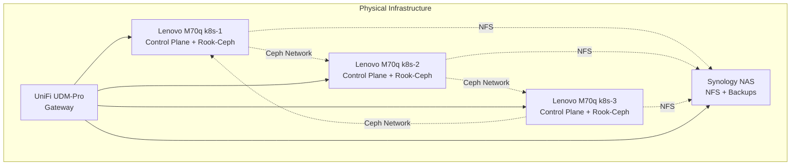
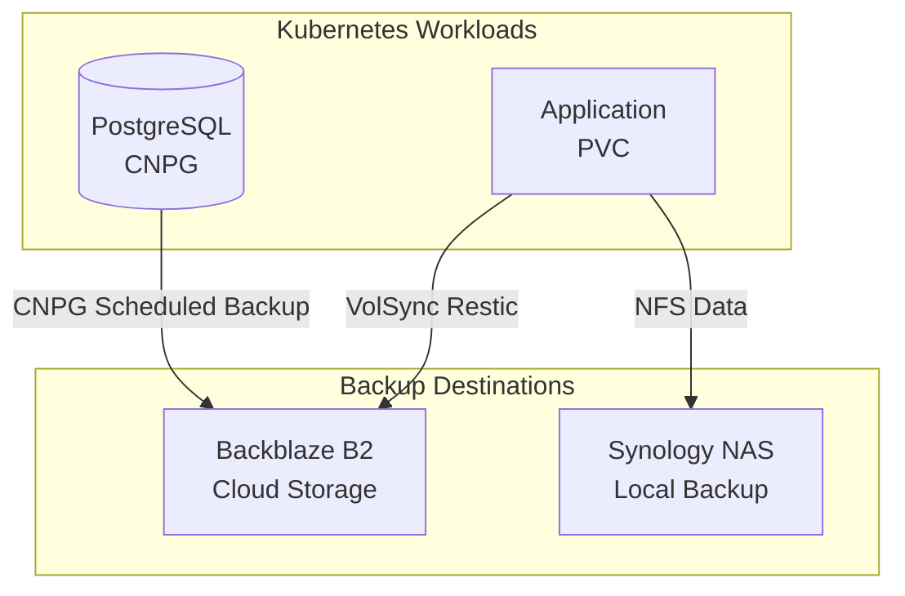

# Infrastructure Architecture

High-level overview of the home infrastructure components and how they interconnect. For detailed configuration, see [Overview](overview.md), [Networking](networking.md), and [Storage](../kubernetes/storage.md).

## High-Level Architecture

The infrastructure runs on **bare-metal Lenovo M70q systems** with Talos Linux, internal **Rook-Ceph storage**, **Synology NAS**, and **UniFi networking**.


```mermaid
graph TB
    subgraph "Physical Infrastructure"
        K1[Lenovo M70q k8s-1<br/>Control Plane + Rook-Ceph]
        K2[Lenovo M70q k8s-2<br/>Control Plane + Rook-Ceph]
        K3[Lenovo M70q k8s-3<br/>Control Plane + Rook-Ceph]
        SYNO[Synology NAS<br/>NFS + Backups]
        UDM[UniFi UDM-Pro<br/>Gateway]
    end

    K1 -.Ceph Network.-> K2
    K2 -.Ceph Network.-> K3
    K3 -.Ceph Network.-> K1

    K1 -.NFS.-> SYNO
    K2 -.NFS.-> SYNO
    K3 -.NFS.-> SYNO

    UDM --> K1
    UDM --> K2
    UDM --> K3
    UDM --> SYNO
```

<div class="diagram-note">💡 **Tip**: Large diagrams can be enlarged in most browsers by right-clicking and selecting "Inspect" or using browser zoom (Ctrl+/Cmd+).</div>

---

## Physical Hardware

### Bare-Metal Kubernetes Cluster (3x Lenovo M70q)

**Purpose**: Kubernetes control plane and compute nodes with integrated Rook-Ceph storage

**Specifications**:
- **Systems**: 3x Lenovo ThinkCentre M70q Tiny (Gen 3)
- **Network**: 2.5GbE primary + secondary Ceph network interface
- **Storage**: NVMe SSDs + Samsung SATA SSDs for Ceph OSDs
- **GPU**: Intel integrated graphics (i915) on all nodes for hardware transcoding

Three control plane nodes running Talos Linux with integrated Rook-Ceph storage. See [Infrastructure Overview](overview.md#cluster-nodes) for detailed node configuration, IPs, and network setup.

---

## Storage Infrastructure

### Rook-Ceph Distributed Storage

**Purpose**: Persistent block storage for Kubernetes workloads

**Architecture**: Internal Rook-Ceph cluster running on Kubernetes nodes

**Configuration**:
- **Public Network**: 192.168.5.0/24 (primary network)
- **Cluster Network**: 192.168.43.0/24 (dedicated Ceph replication network)
- **Device Filter**: `/dev/disk/by-id/ata-SAMSUNG*` (Samsung SSDs)
- **Pool**: `ceph-blockpool` (single RBD block pool)
- **Replication**: 3x replication across nodes, host failure domain
- **Compression**: aggressive with zstd algorithm
- **CephFS**: Not configured (`cephFileSystems: []`)
- **Object Storage**: Not configured (`cephObjectStores: []`)

Storage classes: `ceph-ssd` (default), `openebs-hostpath`, `nfs-media`. See [Storage Management](../kubernetes/storage.md) for details.

Configuration: [`kubernetes/apps/rook-ceph/rook-ceph/cluster/`](https://github.com/tscibilia/home-ops/tree/main/kubernetes/apps/rook-ceph/rook-ceph/cluster)

### Synology NAS

**Purpose**: Bulk file storage, NFS media shares, and backup destination

**Capabilities**:
- **NFS Server**: Exports shares consumed by Kubernetes (`nfs-media` storage class)
- **Backup Target**: Stores VolSync backups, CNPG database backups
- **Media Library**: Centralized storage for Plex, Jellyfin media files

**Integration**:
- Kubernetes CSI NFS driver mounts Synology shares: [`kubernetes/apps/kube-system/csi-driver-nfs/`](https://github.com/tscibilia/home-ops/tree/main/kubernetes/apps/kube-system/csi-driver-nfs)
- IP referenced as `${NAS_IP}` in cluster secrets
- Connected via home LAN (192.168.5.x)

---

## Network Infrastructure

### UniFi Network (UDM-Pro)

**Purpose**: Core network routing, switching, DNS, and Wi-Fi management

**Role**: UniFi Dream Machine Pro serves as:
- **Router**: Gateway for 192.168.5.0/24 LAN
- **DNS Server**: Primary DNS for internal devices (integrated with `unifi-dns`)
- **Controller**: Manages UniFi switches and access points
- **Firewall**: Network segmentation and security policies

**Integration with Kubernetes**:
- **unifi-dns**: External-DNS webhook provider syncs Kubernetes HTTPRoute DNS records to UniFi controller
  - Automatically creates/updates/deletes A records for services
  - Domain filter: `t0m.co`
  - Configuration: [`kubernetes/apps/network/unifi-dns/`](https://github.com/tscibilia/home-ops/tree/main/kubernetes/apps/network/unifi-dns)
- **unpoller**: Prometheus exporter scrapes UniFi metrics (bandwidth, clients, devices)
  - Grafana dashboards visualize network performance
  - Configuration: [`kubernetes/apps/observability/unpoller/`](https://github.com/tscibilia/home-ops/tree/main/kubernetes/apps/observability/unpoller)

**VLANs** (referenced in multus setup):
- Planning to add VLAN isolation for qBittorrent torrent traffic
- See [issue #1168](https://github.com/tscibilia/home-ops/issues/1168) for multus VLAN integration

See [Network Infrastructure](networking.md) for complete network topology, IP allocation, and DNS architecture.

---

## Data Flow Architecture

### Application Data Storage

Three storage classes support different workload types. See [Storage Management](../kubernetes/storage.md) for detailed storage architecture and when to use each class.

### Backup Strategy


```mermaid
graph TB
    subgraph "Kubernetes Workloads"
        DB[(PostgreSQL<br/>CNPG)]
        APP[Application<br/>PVC]
    end

    subgraph "Backup Destinations"
        B2[Backblaze B2<br/>Cloud Storage]
        SYNO[Synology NAS<br/>Local Backup]
    end

    DB -->|CNPG Scheduled Backup| B2
    APP -->|VolSync Restic| B2
    APP -->|NFS Data| SYNO
```

**Backup Components**:
- **VolSync**: Automated PVC backups to Backblaze B2 (every 6 hours)
- **CNPG**: PostgreSQL database backups to B2 (scheduled via CronJob)
- **Synology**: NFS data naturally backed up to NAS snapshots

---

## External Services Integration

The infrastructure integrates with several cloud services:

| Service | Purpose | Usage |
|---------|---------|-------|
| **Cloudflare** | DNS + Tunnel | Zero Trust tunnel exposes services without port forwarding |
| **aKeyless** | Secrets Management | Central vault for all sensitive credentials |
| **Backblaze B2** | Backup Storage | VolSync and CNPG backups destination |
| **Pushover** | Notifications | AlertManager sends critical alerts to mobile |
| **Amazon SES** | Email Delivery | System emails (e.g., password resets) |
| **AirVPN** | VPN | Torrent traffic routing (qBittorrent pod) |

---

## Cluster Resilience

### Single Node Failure

**Impact**: Minimal
- Kubernetes reschedules pods to remaining 2 nodes
- Ceph continues serving data (3x replication across nodes)
- VIP automatically fails over to healthy control plane

**Recovery**: Automatic (pods migrate, Ceph rebalances)

### Two Node Failure

**Impact**: Cluster degraded but functional
- Kubernetes API remains accessible via remaining node
- Ceph enters read-only mode (requires quorum: 2/3 nodes)
- New pods cannot schedule (insufficient capacity)

**Recovery**: Manual (restore failed nodes or rebuild from backup)

### Complete Cluster Loss

**Impact**: All Kubernetes workloads offline
- Ceph data lost (stored on node disks)
- Synology NAS data unaffected
- Backups available in Backblaze B2

**Recovery**: Full bootstrap process
1. Reinstall Talos on bare-metal nodes
2. Run `just bootstrap` to restore Kubernetes and Rook-Ceph
3. Restore CNPG databases from B2 backups
4. Restore application PVCs via VolSync

See [Bootstrap Guide](bootstrap.md) for disaster recovery procedures.

---

## Performance Characteristics

### Network Performance

- **Kubernetes Internal**: 1 Gbps (pod-to-pod via Cilium on bond0)
- **Ceph Storage**: 2.5 Gbps (dedicated Ceph network on ceph0)
- **Internet Uplink**: Varies (home ISP connection)
- **Cloudflare Tunnel**: ~50-100ms latency (depends on Cloudflare edge location)

---

## Scaling Considerations

### Horizontal Scaling (Add Nodes)

**Limited**: Cluster designed for 3 control plane nodes
- Would require additional M70q systems as worker nodes
- Ceph storage capacity scales by adding more OSDs (disks) to existing nodes

### Vertical Scaling (More Resources)

**Constrained by hardware**:
- M70q systems have fixed CPU/RAM (can upgrade RAM modules)
- Expand Ceph by adding larger SSDs
- Upgrade Synology NAS capacity

### Storage Expansion

**Ceph**: Add more SSDs to nodes or replace existing drives with larger capacity
**Synology**: Add more drives or replace with larger capacity

---

## Future Improvements

Potential architecture enhancements tracked in GitHub issues:

- **Larger SSDs**: Upgrade Ceph OSDs to higher capacity Samsung SSDs
- **Separate Worker Nodes**: Add dedicated worker nodes for workloads
- **CephFS**: Enable shared filesystem support for multi-pod RWX access
- **Object Storage**: Consider adding MinIO/Garage for S3-compatible storage

---

## Architecture Diagrams

### Full Stack Overview

```
┌─────────────────────────────────────────────────────────────┐
│ External Services (Cloud)                                   │
│  • Cloudflare (DNS + Tunnel)                                │
│  • aKeyless (Secrets)                                       │
│  • Backblaze B2 (Backups)                                   │
└─────────────────────────────────────────────────────────────┘
                           ▲
                           │ HTTPS/API
                           ▼
┌─────────────────────────────────────────────────────────────┐
│ Kubernetes Applications                                     │
│  • Media Apps (Plex, Jellyfin, Sonarr, Radarr)             │
│  • Observability (Grafana, Prometheus, Gatus)              │
│  • Databases (PostgreSQL via CNPG)                          │
└─────────────────────────────────────────────────────────────┘
                           ▲
                           │
┌──────────────────────────┼──────────────────────────────────┐
│ Kubernetes Infrastructure│                                  │
│  • Cilium CNI            │  • Flux CD GitOps               │
│  • Rook-Ceph Storage     │  • Cert-Manager                 │
│  • External-Secrets      │  • Envoy Gateway                │
└──────────────────────────┼──────────────────────────────────┘
                           │
        ┌──────────────────┼──────────────────┐
        │                  │                  │
        ▼                  ▼                  ▼
┌──────────────┐  ┌──────────────┐  ┌──────────────┐
│ k8s-1        │  │ k8s-2        │  │ k8s-3        │
│ M70q         │  │ M70q         │  │ M70q         │
│ Control Plane│  │ Control Plane│  │ Control Plane│
│ Rook-Ceph    │  │ Rook-Ceph    │  │ Rook-Ceph    │
│ Intel iGPU   │  │ Intel iGPU   │  │ Intel iGPU   │
└──────────────┘  └──────────────┘  └──────────────┘
        │                  │                  │
        └──────────────────┼──────────────────┘
                           │ Ceph Network (192.168.43.0/24)
                           │ Samsung SSDs (Rook-Ceph OSDs)
                           ▼
┌──────────────┐              ┌──────────────────────────┐
│ Synology NAS │◄─────────────│ UniFi Network (UDM-Pro)  │
│ NFS + Backup │              │  • DNS Integration       │
└──────────────┘              │  • Network Monitoring    │
                              └──────────────────────────┘
```

---

## Next Steps

- [Networking Deep Dive](networking.md): Physical network topology, VLANs, DNS architecture
- [Kubernetes Networking](../kubernetes/networking.md): Cilium, service mesh, ingress
- [Storage Management](../kubernetes/storage.md): PVCs, storage classes, backups
- [Bootstrap Guide](bootstrap.md): Disaster recovery and cluster rebuild procedures
