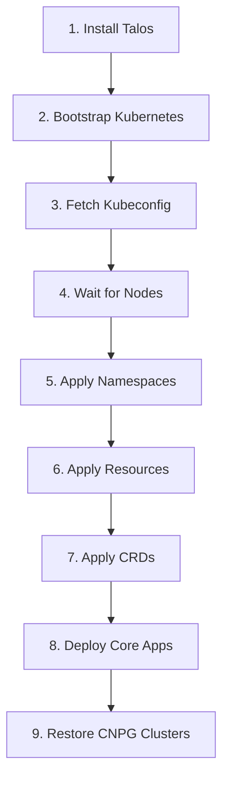

# Bootstrap Guide

This guide walks you through bootstrapping the cluster from scratch—useful for disaster recovery or setting up a new cluster.

## Prerequisites

Before starting, ensure you have:

1. **Hardware**: Three nodes with Talos OS images (USB or PXE boot)
2. **Network**: Nodes connected to your home network with access to 192.168.5.0/24
3. **Tools**: All CLI tools installed via `mise install`
4. **Secrets**: Access to aKeyless with `akeyless` CLI configured
5. **Repository**: This Git repository cloned locally

??? info "Tool Setup"
    Install all required tools via mise:

    ```bash
    mise install
    ```

    Configure aKeyless CLI:

    ```bash
    akeyless configure --access-type api_key \
      --access-id <your-access-id> \
      --access-key <your-access-key>
    ```

    Verify authentication:

    ```bash
    akeyless auth
    ```

## Bootstrap Overview

The bootstrap process follows these stages (defined in [`bootstrap/mod.just`](https://github.com/tscibilia/home-ops/blob/main/bootstrap/mod.just)):



<div class="diagram-note">💡 **Tip**: Large diagrams can be enlarged in most browsers by right-clicking and selecting "Inspect" or using browser zoom (Ctrl+/Cmd+).</div>

## Full Bootstrap Command

To run all stages in sequence:

```bash
just bootstrap
```

This is equivalent to running:

```bash
just bootstrap talos
just bootstrap k8s
just bootstrap kubeconfig
just bootstrap wait
just bootstrap namespaces
just bootstrap rook-ceph-external  # If using external Ceph
just bootstrap resources
just bootstrap crds
just bootstrap apps
just bootstrap cnpg
```

## Step-by-Step Bootstrap

For more control or troubleshooting, run each stage individually:

### Stage 1: Install Talos

```bash
just bootstrap talos
```

**What it does:**

- Reads node configurations from [`talos/nodes/*.yaml.j2`](https://github.com/tscibilia/home-ops/tree/main/talos/nodes)
- Renders Talos machine configs using `minijinja-cli`
- Injects secrets from aKeyless using [`bootstrap/scripts/akeyless-inject.sh`](https://github.com/tscibilia/home-ops/blob/main/bootstrap/scripts/akeyless-inject.sh)
- Applies configurations to each node via `talosctl apply-config --insecure`

**Expected output:**

```
INFO Running stage... stage=talos
INFO Talos config applied node=talos-m01
INFO Talos config applied node=talos-m02
INFO Talos config applied node=talos-m03
```

??? tip "If Nodes Already Have Talos"
    If nodes are already running Talos, the command detects this and skips:

    ```
    INFO Talos already configured, skipping apply of config stage=talos node=talos-m01
    ```

    To force reapplication, manually run:

    ```bash
    just talos apply-node talos-m01 --insecure
    ```

### Stage 2: Bootstrap Kubernetes

```bash
just bootstrap k8s
```

**What it does:**

- Runs `talosctl bootstrap` on the first control plane node (determined by `talosctl config info`)
- Initializes etcd and the Kubernetes control plane
- Retries if bootstrap is already in progress

**Expected output:**

```
INFO Running stage... stage=k8s
INFO Kubernetes bootstrap complete
```

??? warning "Bootstrap Only Runs Once"
    If Kubernetes is already bootstrapped:

    ```
    ERROR: rpc error: code = FailedPrecondition desc = etcd is already bootstrapped
    ```

    This is normal—it means the cluster is already initialized. The bootstrap command handles this gracefully.

### Stage 3: Fetch Kubeconfig

```bash
just bootstrap kubeconfig
```

**What it does:**

- Fetches `kubeconfig` from the cluster via `talosctl kubeconfig`
- Saves to `kubeconfig` in the repository root
- Sets context name to `main`
- Configures kubectl to use the Cilium LoadBalancer VIP (192.168.5.200)

**Expected output:**

```
INFO Running stage... stage=kubeconfig
INFO Kubeconfig saved to /home/sysadmin/home-ops/kubeconfig
```

**Verify:**

```bash
export KUBECONFIG=$(pwd)/kubeconfig
kubectl get nodes
```

You should see nodes in `NotReady` state (Cilium isn't installed yet).

### Stage 4: Wait for Nodes

```bash
just bootstrap wait
```

**What it does:**

- Waits for all nodes to transition from `NotReady` → `Ready`
- Ensures the cluster is stable before proceeding

**Expected output:**

```
INFO Running stage... stage=wait
INFO Waiting for nodes to be ready...
node/talos-m01 condition met
node/talos-m02 condition met
node/talos-m03 condition met
```

### Stage 5: Apply Namespaces

```bash
just bootstrap namespaces
```

**What it does:**

- Scans [`kubernetes/apps/*/namespace.yaml`](https://github.com/tscibilia/home-ops/tree/main/kubernetes/apps) files
- Extracts namespace definitions using `kustomize`
- Applies namespaces using `kubectl apply --server-side`

**Expected output:**

```
INFO Running stage... stage=namespaces
namespace/actions-runner-system created
namespace/cert-manager created
namespace/database created
namespace/default configured
...
```

### Stage 6: Apply Resources

```bash
just bootstrap resources
```

**What it does:**

- Renders [`bootstrap/resources.yaml.j2`](https://github.com/tscibilia/home-ops/blob/main/bootstrap/resources.yaml.j2) using `minijinja-cli`
- Injects secrets from aKeyless via `akeyless-inject.sh`
- Applies rendered resources (ConfigMaps, Secrets, etc.)

**Expected output:**

```
INFO Running stage... stage=resources
✓ Injecting secrets...
configmap/cluster-secrets created
secret/github-deploy-key created
...
```

**What's in `resources.yaml.j2`:**

- `cluster-secrets` ConfigMap: Contains cluster-wide variables like `SECRET_DOMAIN`, VIP addresses, etc.
- GitHub deploy keys for Flux
- Other bootstrap-time secrets

### Stage 7: Apply CRDs

```bash
just bootstrap crds
```

**What it does:**

- Renders CRDs from [`bootstrap/helmfile.d/00-crds.yaml`](https://github.com/tscibilia/home-ops/blob/main/bootstrap/helmfile.d/00-crds.yaml) using Helmfile
- Applies Custom Resource Definitions to the cluster

**Expected output:**

```
INFO Running stage... stage=crds
customresourcedefinition.apiextensions.k8s.io/helmreleases.helm.toolkit.fluxcd.io created
customresourcedefinition.apiextensions.k8s.io/kustomizations.kustomize.toolkit.fluxcd.io created
...
```

### Stage 8: Deploy Core Apps

```bash
just bootstrap apps
```

**What it does:**

- Deploys core infrastructure from [`bootstrap/helmfile.d/01-apps.yaml`](https://github.com/tscibilia/home-ops/blob/main/bootstrap/helmfile.d/01-apps.yaml)
- Apps deploy in strict dependency order via Helmfile

**Deployment order:**

1. **Cilium**: CNI networking (eBPF, kube-proxy replacement)
2. **CoreDNS**: Cluster DNS
3. **Spegel**: OCI image mirror (reduces external registry load)
4. **cert-manager**: TLS certificate automation
5. **external-secrets**: Syncs secrets from aKeyless

**Expected output:**

```
INFO Running stage... stage=apps
Upgrading release=cilium, chart=cilium/cilium
Release "cilium" does not exist. Installing it now.
...
Upgrading release=coredns, chart=coredns/coredns
...
```

**Verify:**

```bash
kubectl get pods -n kube-system
kubectl get pods -n cert-manager
kubectl get pods -n external-secrets
```

### Stage 9: Restore CNPG Clusters

```bash
just bootstrap cnpg
```

**What it does:**

- Waits for CNPG operator to be ready
- Attempts to apply CNPG cluster definitions from [`bootstrap/cnpg/`](https://github.com/tscibilia/home-ops/tree/main/bootstrap/cnpg)
- If backups exist in S3, clusters restore from backup
- If backups don't exist, cluster creation fails gracefully and Flux creates fresh clusters later

**Expected output (with backups):**

```
INFO Running stage... stage=cnpg
cluster.postgresql.cnpg.io/pgsql-cluster created
```

**Expected output (no backups):**

```
INFO Running stage... stage=cnpg
ERROR: cluster.postgresql.cnpg.io/pgsql-cluster: backup not found
INFO CNPG cluster creation failed (likely no backups exist). Clusters will be created by Flux. stage=cnpg
```

This is normal! Flux will create fresh CNPG clusters if backups don't exist.

## Post-Bootstrap

After bootstrap completes, Flux takes over:

1. **Flux watches Git**: Monitors [`kubernetes/flux/`](https://github.com/tscibilia/home-ops/tree/main/kubernetes/flux) for changes
2. **Apps deploy automatically**: Flux reconciles [`kubernetes/apps/`](https://github.com/tscibilia/home-ops/tree/main/kubernetes/apps) and deploys all applications
3. **Renovate creates PRs**: Automated dependency updates via GitHub Actions

**Verify Flux is running:**

```bash
flux get all -A
```

**Watch app deployments:**

```bash
watch kubectl get helmreleases -A
```

## Common Bootstrap Scenarios

### Scenario 1: Fresh Cluster (No Backups)

Starting from scratch with no existing backups:

```bash
# 1. Boot nodes from Talos ISO
# 2. Run full bootstrap
just bootstrap

# 3. Wait for Flux to deploy apps (5-10 minutes)
watch kubectl get pods -A

# 4. Configure apps manually (databases, auth, etc.)
```

### Scenario 2: Disaster Recovery (With Backups)

Rebuilding after catastrophic failure:

```bash
# 1. Factory reset all nodes
just talos reset-node talos-m01  # Confirm prompt
just talos reset-node talos-m02  # Confirm prompt
just talos reset-node talos-m03  # Confirm prompt

# 2. Boot nodes from Talos ISO
# 3. Run full bootstrap
just bootstrap

# 4. CNPG clusters restore from S3 backups automatically
# 5. Flux deploys apps
# 6. Restore VolSync PVCs for stateful apps

# Restore app data (example: Immich)
just kube volsync-restore default immich 1
```

??? danger "Reset Nodes Wipe All Data"
    `just talos reset-node` performs a factory reset, wiping:

    - All Kubernetes state
    - All persistent volumes
    - All Talos configuration

    **Always ensure you have:**

    - VolSync backups of application data
    - CNPG backups of databases
    - Access to aKeyless for secrets

    Before running reset commands!

### Scenario 3: Partial Bootstrap (Testing Changes)

Testing changes to bootstrap configuration:

```bash
# Re-run specific stages
just bootstrap namespaces
just bootstrap resources
just bootstrap crds
just bootstrap apps
```

## Troubleshooting Bootstrap

### Nodes Stuck in NotReady

**Cause**: Cilium failed to deploy

**Fix**:

```bash
# Check Cilium status
kubectl get pods -n kube-system | grep cilium

# View Cilium logs
kubectl logs -n kube-system daemonset/cilium

# Re-deploy Cilium via Helmfile
just bootstrap apps
```

### Bootstrap Hangs at "Waiting for nodes"

**Cause**: Node networking issue or Talos config error

**Fix**:

```bash
# Check Talos service status on each node
talosctl -n 192.168.5.201 service kubelet status
talosctl -n 192.168.5.202 service kubelet status
talosctl -n 192.168.5.203 service kubelet status

# Check node logs
talosctl -n 192.168.5.201 logs kubelet

# Reboot stuck nodes
just talos reboot-node talos-m01
```

### aKeyless Secrets Not Injecting

**Cause**: aKeyless CLI not authenticated

**Fix**:

```bash
# Re-authenticate
akeyless auth

# Test secret retrieval
akeyless get-secret-value --name talos/MACHINE_TOKEN

# Re-run resource stage
just bootstrap resources
```

### CRDs Already Exist

**Error**: `customresourcedefinition.apiextensions.k8s.io/kustomizations.kustomize.toolkit.fluxcd.io already exists`

**Fix**: This is normal! `kubectl apply --server-side` handles existing resources gracefully. The bootstrap continues.

## Bootstrap File Reference

Key files involved in bootstrap:

| File | Purpose |
|------|---------|
| [`bootstrap/mod.just`](https://github.com/tscibilia/home-ops/blob/main/bootstrap/mod.just) | Bootstrap stage definitions |
| [`bootstrap/scripts/akeyless-inject.sh`](https://github.com/tscibilia/home-ops/blob/main/bootstrap/scripts/akeyless-inject.sh) | Injects `ak://` secrets from aKeyless |
| [`bootstrap/resources.yaml.j2`](https://github.com/tscibilia/home-ops/blob/main/bootstrap/resources.yaml.j2) | Bootstrap-time ConfigMaps and Secrets |
| [`bootstrap/helmfile.d/00-crds.yaml`](https://github.com/tscibilia/home-ops/blob/main/bootstrap/helmfile.d/00-crds.yaml) | Flux CRDs |
| [`bootstrap/helmfile.d/01-apps.yaml`](https://github.com/tscibilia/home-ops/blob/main/bootstrap/helmfile.d/01-apps.yaml) | Core infrastructure apps |
| [`bootstrap/cnpg/`](https://github.com/tscibilia/home-ops/tree/main/bootstrap/cnpg) | CNPG cluster definitions with backup recovery |
| [`talos/machineconfig.yaml.j2`](https://github.com/tscibilia/home-ops/blob/main/talos/machineconfig.yaml.j2) | Base Talos configuration |
| [`talos/nodes/*.yaml.j2`](https://github.com/tscibilia/home-ops/tree/main/talos/nodes) | Node-specific Talos overrides |

## Next Steps

- [Infrastructure Overview](overview.md): Learn about Talos OS and node architecture
- [Secrets Management](../kubernetes/secrets.md): Understand aKeyless integration
- [Operations Guide](../operations/overview.md): Day-to-day cluster management
