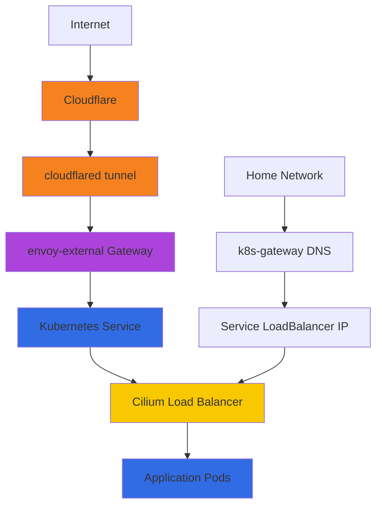

# Networking Architecture

The cluster's networking is built on several layers that work together to route traffic from the internet to your apps, and between apps themselves.

## Network Stack Overview



## Core Components

### Cilium: CNI & Load Balancing

[Cilium](https://github.com/tscibilia/home-ops/tree/main/kubernetes/apps/kube-system/cilium) is the Container Network Interface (CNI) that connects pods. It replaces kube-proxy with eBPF-based networking for better performance.

Key features configured in [`kubernetes/apps/kube-system/cilium/app/helmrelease.yaml`](https://github.com/tscibilia/home-ops/blob/main/kubernetes/apps/kube-system/cilium/app/helmrelease.yaml):

- **Native routing**: Pods communicate directly without overlay networking
- **L2 announcements**: Broadcasts LoadBalancer IPs via ARP on your home LAN
- **kube-proxy replacement**: Uses eBPF instead of iptables (faster, more efficient)
- **Maglev hashing**: Consistent load balancing across pods

??? example "How Cilium LoadBalancer Works"
    When you create a Service with `type: LoadBalancer`:

    1. Cilium allocates an IP from `CiliumLoadBalancerIPPool` (range: part of 192.168.5.0/24)
    2. `CiliumL2AnnouncementPolicy` broadcasts the IP via ARP
    3. Devices on your LAN see the IP as reachable on the network
    4. Traffic hits the IP → Cilium routes it to healthy pods

    No external load balancer needed—Cilium handles it all.

### DNS Resolution

#### CoreDNS

Internal cluster DNS at `10.43.0.10`. Configured in [`kubernetes/apps/kube-system/coredns/`](https://github.com/tscibilia/home-ops/tree/main/kubernetes/apps/kube-system/coredns).

- Resolves `*.cluster.local` (internal service discovery)
- Falls through to upstream DNS for external queries
- Pods use this automatically via `kubelet` configuration

??? tip "Service DNS Pattern"
    Services are automatically resolvable:

    ```
    <service-name>.<namespace>.svc.cluster.local
    ```

    Examples:
    - `postgresql.database.svc.cluster.local` - PostgreSQL database
    - `dragonfly-cluster.database.svc.cluster.local` - Redis cache
    - `authentik.default.svc.cluster.local` - Authentik SSO

#### unifi-dns (external-dns with UniFi provider)

Syncs DNS records from Kubernetes to your UniFi Controller. Configured in [`kubernetes/apps/network/unifi-dns/`](https://github.com/tscibilia/home-ops/tree/main/kubernetes/apps/network/unifi-dns).

- Watches HTTPRoute and Service resources
- Automatically creates/updates/deletes A records in UniFi
- Domain filter: `${SECRET_DOMAIN}` (your domain)
- TXT record prefix: `k8s.main.` for ownership tracking

When you create an HTTPRoute for `sonarr.yourdomain.com`, external-dns automatically creates the DNS record in UniFi pointing to the Service's LoadBalancer IP.

#### external-dns (Cloudflare provider)

Syncs HTTPRoutes to Cloudflare DNS for external access. Configured in [`kubernetes/apps/network/external-dns/`](https://github.com/tscibilia/home-ops/tree/main/kubernetes/apps/network/external-dns).

- Watches `envoy-external` Gateway HTTPRoutes
- Creates DNS records in Cloudflare with `--cloudflare-proxied` (orange cloud)
- Routes marked for external access get synced; internal-only routes are ignored

### Envoy Gateway: Ingress Controller

Envoy Gateway routes HTTP/HTTPS traffic to services. Two gateways:

- **`envoy-external`**: Internet-facing (receives traffic from Cloudflare tunnel)
- **`envoy-internal`**: LAN-only (for internal services)

Configured in [`kubernetes/apps/network/envoy-gateway/`](https://github.com/tscibilia/home-ops/tree/main/kubernetes/apps/network/envoy-gateway).

HTTPRoutes define routing rules:

```yaml
apiVersion: gateway.networking.k8s.io/v1
kind: HTTPRoute
metadata:
  name: sonarr
spec:
  parentRefs:
    - name: envoy-external  # Use external gateway
  hostnames:
    - sonarr.${SECRET_DOMAIN}
  rules:
    - backendRefs:
        - name: sonarr
          port: 80
```

This routes `sonarr.yourdomain.com` → `sonarr` Service → Sonarr pods.

??? info "SecurityPolicy: Forward Auth"
    Apps protected by Authentik use a SecurityPolicy:

    ```yaml
    apiVersion: gateway.envoyproxy.io/v1alpha1
    kind: SecurityPolicy
    metadata:
      name: sonarr
    spec:
      extAuth:
        http:
          backendRefs:
            - name: authentik-outpost-external
              port: 9000
          path: /outpost.goauthentik.io/auth/envoy
      targetRefs:
        - kind: HTTPRoute
          name: sonarr
    ```

    Before forwarding traffic, Envoy calls Authentik to validate the session. If unauthorized, Envoy redirects to the Authentik login page.

    See the [ext-auth component](https://github.com/tscibilia/home-ops/tree/main/kubernetes/components/ext-auth-external) for details.

### Cloudflared Tunnel

Cloudflared establishes a secure tunnel from Cloudflare to your cluster. Configured in [`kubernetes/apps/network/cloudflared/`](https://github.com/tscibilia/home-ops/tree/main/kubernetes/apps/network/cloudflared).

- Runs as a Deployment in the `network` namespace
- QUIC tunnel to Cloudflare (encrypted, no inbound firewall rules needed)
- Routes `*.${SECRET_DOMAIN}` → `envoy-external.network.svc.cluster.local:443`

Traffic flow:

1. User visits `sonarr.yourdomain.com`
2. Cloudflare DNS resolves to Cloudflare edge
3. Cloudflare edge forwards via tunnel to `cloudflared` pod
4. `cloudflared` forwards to `envoy-external` gateway
5. Envoy routes based on HTTPRoute rules

No port forwarding, no exposing your home IP. Everything goes through Cloudflare's secure tunnel.

## Traffic Flows

### External Access (Internet → App)


1. DNS resolves `sonarr.yourdomain.com` to Cloudflare
2. Cloudflare tunnels request to `cloudflared` pod
3. `cloudflared` forwards to `envoy-external:443`
4. Envoy Gateway checks HTTPRoute, applies SecurityPolicy (Authentik auth)
5. Envoy forwards to `sonarr` Service
6. Cilium load balances to healthy `sonarr` pods

### Internal Access (LAN → App)


1. DNS query to UniFi controller resolves `sonarr.yourdomain.com`
2. UniFi returns Service LoadBalancer IP (managed by external-dns)
3. Traffic hits LoadBalancer IP on the cluster network
4. Cilium routes to healthy pods

### Inter-Pod Communication

Pods talk directly via cluster DNS:

```
postgresql.database.svc.cluster.local
```

Cilium routes traffic using native routing (no overlay/tunneling). Pods get IPs from `10.42.0.0/16` (defined in [`talos/machineconfig.yaml.j2:145`](https://github.com/tscibilia/home-ops/blob/main/talos/machineconfig.yaml.j2#L145)).

## Certificate Management

TLS certificates are handled by [cert-manager](https://github.com/tscibilia/home-ops/tree/main/kubernetes/apps/cert-manager/cert-manager). Certificates live in [`kubernetes/apps/network/certificates/`](https://github.com/tscibilia/home-ops/tree/main/kubernetes/apps/network/certificates).

### How it Works

1. Envoy Gateway HTTPRoutes reference `certificateRef` (a Secret)
2. cert-manager watches Certificate CRDs
3. cert-manager requests certificates from Let's Encrypt via DNS-01 challenge (Cloudflare)
4. Certificates are automatically renewed before expiration

No manual certificate management. Just define the Certificate CRD and cert-manager does the rest.

## Cross-Namespace Access

By default, Kubernetes blocks cross-namespace references. To allow it, use a ReferenceGrant.

Example from [`kubernetes/apps/default/authentik/app/resources/referencegrant.yaml`](https://github.com/tscibilia/home-ops/tree/main/kubernetes/apps/default/authentik/app/resources):

```yaml
apiVersion: gateway.networking.k8s.io/v1beta1
kind: ReferenceGrant
metadata:
  name: authentik-outpost
  namespace: default
spec:
  from:
    - group: gateway.envoyproxy.io
      kind: SecurityPolicy
      namespace: network
  to:
    - group: ""
      kind: Service
```

This allows SecurityPolicies in the `network` namespace to reference Authentik's outpost Service in `default`.

## Network Policies

Cilium enforces NetworkPolicies (Kubernetes standard) and CiliumNetworkPolicies (Cilium-specific). These control which pods can talk to each other.

By default, all traffic is allowed. To restrict, create NetworkPolicy CRDs.

## Observability

Network metrics are collected by:

- **Unpoller**: Scrapes UniFi Controller for network stats (bandwidth, clients, etc.)
- **Cilium Hubble**: eBPF-based flow observability (see traffic between pods)
- **VictoriaMetrics**: Stores time-series metrics from both

See the [Observability Guide](../operations/observability.md) for details.

## Common Networking Tasks

### Exposing a New App Externally

1. Create an HTTPRoute in the app's `resources/`:

    ```yaml
    apiVersion: gateway.networking.k8s.io/v1
    kind: HTTPRoute
    metadata:
      name: myapp
    spec:
      parentRefs:
        - name: envoy-external
      hostnames:
        - myapp.${SECRET_DOMAIN}
      rules:
        - backendRefs:
            - name: myapp
              port: 80
    ```

2. Include `ext-auth-external` component in `ks.yaml` if you want SSO protection
3. Push to Git; Flux applies it
4. external-dns creates DNS records in Cloudflare automatically

### Exposing a New App Internally (LAN Only)

Same process, but use `envoy-internal` gateway and don't include ext-auth component.

### Debugging Network Issues

```bash
# Check Cilium status
cilium status

# View Cilium connectivity
cilium connectivity test

# Check LoadBalancer IPs
kubectl get svc -A | grep LoadBalancer

# View HTTPRoutes
kubectl get httproute -A

# Check Envoy Gateway status
kubectl get gateway -n network

# Test DNS resolution from a pod
kubectl run -it --rm debug --image=nicolaka/netshoot --restart=Never -- nslookup postgresql.database.svc.cluster.local
```

## Next Steps

- [Storage Guide](storage.md): Persistent volumes and backups
- [Operations Guide](../operations/overview.md): Day-to-day maintenance
