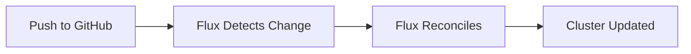
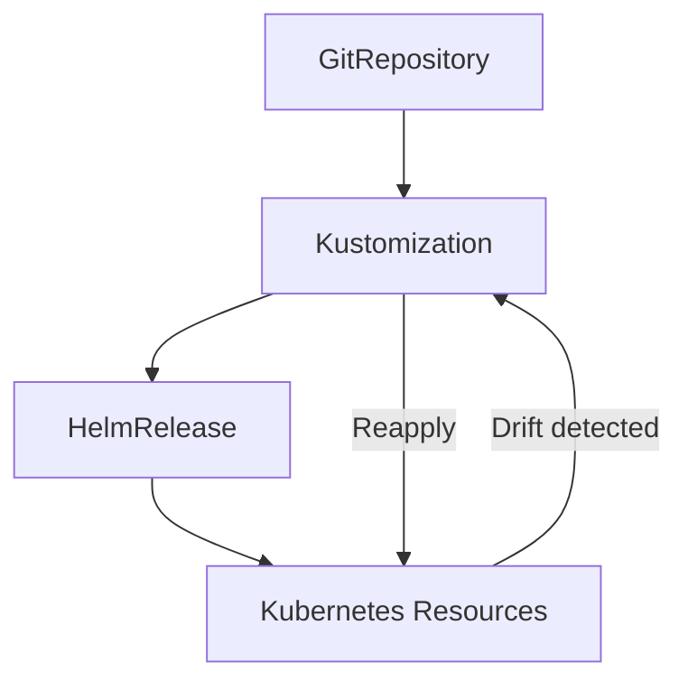

# Kubernetes Layer Overview

The Kubernetes layer is where applications live. Everything is managed through Flux CD—a GitOps toolkit that watches this repository and automatically applies changes to the cluster.

## How GitOps Works Here

The workflow is simple:



1. You edit YAML files in [`kubernetes/apps/`](https://github.com/tscibilia/home-ops/tree/main/kubernetes/apps)
2. Commit and push to GitHub
3. Flux detects the change (polls every hour, or you can force it)
4. Flux applies the changes to the cluster
5. Done—no manual `kubectl apply` needed

If someone manually edits something in the cluster, Flux reverts it back to match Git. This prevents drift and ensures Git is always the source of truth.

## Directory Structure

Applications are organized by namespace:

```
kubernetes/
├── apps/                    # All applications
│   ├── default/            # Main apps (Authentik, Immich, etc.)
│   ├── media/              # Media stack (Plex, Sonarr, etc.)
│   ├── database/           # Database layer (CNPG, Dragonfly)
│   ├── network/            # Networking (Envoy, Cloudflared)
│   ├── observability/      # Monitoring (Grafana, VictoriaMetrics)
│   ├── kube-system/        # Core K8s components (Cilium, CoreDNS)
│   ├── rook-ceph/          # Storage backend
│   ├── external-secrets/   # Secrets management
│   └── ...                 # Other namespaces
├── components/             # Reusable Kustomize components
│   ├── cnpg/              # Database provisioning
│   ├── ext-auth-external/ # Authentik SSO (external gateway)
│   ├── ext-auth-internal/ # Authentik SSO (internal gateway)
│   ├── volsync/           # Backup/restore
│   ├── keda/              # Auto-scaling configs
│   └── common/            # Alerts and secrets
└── flux/                  # Flux CD bootstrap config
```

## Application Structure Pattern

Every app follows the same structure. Let's look at Authentik as an example:

```
kubernetes/apps/default/authentik/
├── ks.yaml                 # Flux Kustomization (orchestrates everything)
├── app/
│   ├── kustomization.yaml  # Kustomize resources list
│   ├── helmrelease.yaml    # Helm chart configuration
│   ├── ocirepository.yaml  # Where to fetch the chart from
│   ├── externalsecret.yaml # Secrets from aKeyless
│   └── resources/          # Additional resources (optional)
├── outposts/               # Authentik-specific: outpost deployments
└── namespace.yaml          # Namespace definition
```

### The Heart: `ks.yaml`

This is the Flux Kustomization that ties everything together. From [`kubernetes/apps/default/authentik/ks.yaml`](https://github.com/tscibilia/home-ops/blob/main/kubernetes/apps/default/authentik/ks.yaml):

```yaml
apiVersion: kustomize.toolkit.fluxcd.io/v1
kind: Kustomization
metadata:
  name: authentik
spec:
  path: ./kubernetes/apps/default/authentik/app
  interval: 1h  # Check Git every hour

  components:
    - ../../../../components/cnpg  # Include database setup

  dependsOn:
    - name: cnpg-cluster  # Wait for database to be ready
      namespace: database
    - name: secret-stores  # Wait for secrets infrastructure
      namespace: external-secrets

  postBuild:
    substitute:
      APP: authentik
      GATUS_SUBDOMAIN: auth
      CNPG_NAME: pgsql-cluster
      AUTHENTIK_VERSION: "2025.10.2"
    substituteFrom:
      - kind: Secret
        name: cluster-secrets  # Inject cluster-wide secrets

  healthChecks:
    - apiVersion: postgresql.cnpg.io/v1
      kind: Cluster
      name: pgsql-cluster  # Wait for this specific database
      namespace: database
```

??? question "What does each section do?"
    **`path`**: Points to the `app/` directory containing the actual Kubernetes manifests.

    **`interval`**: How often Flux checks Git for changes. `1h` means hourly automatic sync.

    **`components`**: Includes reusable Kustomize components. The `cnpg` component automatically creates database users and credentials.

    **`dependsOn`**: Ensures deployment order. Authentik won't deploy until its database exists.

    **`postBuild.substitute`**: Variable substitution. `${APP}` in YAML files gets replaced with `authentik`.

    **`postBuild.substituteFrom`**: Injects values from existing Kubernetes resources (like the `cluster-secrets` ConfigMap).

    **`healthChecks`**: Flux waits for these resources to be healthy before marking this Kustomization as Ready.

### The Helm Release

Inside `app/`, the `helmrelease.yaml` defines the Helm chart and values:

```yaml title="kubernetes/apps/default/authentik/app/helmrelease.yaml (simplified)"
apiVersion: helm.toolkit.fluxcd.io/v2
kind: HelmRelease
metadata:
  name: authentik
spec:
  interval: 1h
  chart:
    spec:
      chart: authentik
      version: ${AUTHENTIK_VERSION}  # Substituted from ks.yaml
      sourceRef:
        kind: OCIRepository
        name: authentik

  values:
    replicas: 2
    envFrom:
      - secretRef:
          name: authentik-secret  # Created by ExternalSecret
```

The `${AUTHENTIK_VERSION}` variable gets replaced with `2025.10.2` (from `ks.yaml`). This makes version bumps easy—just update the version in one place.

??? tip "Finding Helm Chart Values"
    Each Helm chart has different configuration options. To see available values:

    1. Check the chart's GitHub repository (usually has a README)
    2. Look at the chart's default `values.yaml` file
    3. Use `helm show values <chart-name>` after adding the repo

    For Authentik: [https://goauthentik.io/docs/installation/kubernetes](https://goauthentik.io/docs/installation/kubernetes)

### Fetching Charts with OCIRepository

The `ocirepository.yaml` tells Flux where to fetch the Helm chart:

```yaml title="kubernetes/apps/default/authentik/app/ocirepository.yaml"
apiVersion: source.toolkit.fluxcd.io/v1beta2
kind: OCIRepository
metadata:
  name: authentik
spec:
  url: oci://ghcr.io/goauthentik/charts
  interval: 6h
  ref:
    tag: authentik-${AUTHENTIK_VERSION}
```

Flux checks the OCI registry every 6 hours for chart updates. When a new version is available, Renovate (our dependency bot) creates a PR to update `AUTHENTIK_VERSION`.

### Secrets Management

The `externalsecret.yaml` syncs secrets from aKeyless:

```yaml title="kubernetes/apps/default/authentik/app/externalsecret.yaml (simplified)"
apiVersion: external-secrets.io/v1beta1
kind: ExternalSecret
metadata:
  name: authentik
spec:
  target:
    name: authentik-secret  # Creates this Kubernetes Secret
  dataFrom:
    - extract:
        key: authentik  # Fetches from aKeyless path
```

The ExternalSecrets operator watches this CRD, fetches secrets from aKeyless, and creates a regular Kubernetes Secret. The Helm chart then references this secret for environment variables.

## Reusable Components

Located in [`kubernetes/components/`](https://github.com/tscibilia/home-ops/tree/main/kubernetes/components), these are DRY configurations applied to multiple apps.

### CNPG Component

From [`kubernetes/components/cnpg/`](https://github.com/tscibilia/home-ops/tree/main/kubernetes/components/cnpg):

- Creates a database user for the app
- Generates a secret with `username`, `password`, `uri`
- Runs a CronJob to initialize the database

Apps using PostgreSQL include this component in their `ks.yaml`.

### External Auth Components

Two variants for different gateways:

- **`ext-auth-external`**: For apps exposed via `envoy-external` gateway (internet-facing)
- **`ext-auth-internal`**: For apps exposed via `envoy-internal` gateway (LAN-only)

Both create a SecurityPolicy that forwards authentication to Authentik's embedded outpost. See [`kubernetes/components/ext-auth-external/securitypolicy.yaml`](https://github.com/tscibilia/home-ops/blob/main/kubernetes/components/ext-auth-external/securitypolicy.yaml):

```yaml
apiVersion: gateway.envoyproxy.io/v1alpha1
kind: SecurityPolicy
metadata:
  name: "${APP}"
spec:
  extAuth:
    failOpen: false  # Deny if Authentik is down
    http:
      backendRefs:
        - name: authentik-outpost-external
          namespace: default
          port: 9000
      path: /outpost.goauthentik.io/auth/envoy
  targetRefs:
    - kind: HTTPRoute
      name: "${APP}"  # Protects the app's HTTPRoute
```

When an app includes this component, it automatically gets SSO protection through Authentik.

### VolSync Component

From [`kubernetes/components/volsync/`](https://github.com/tscibilia/home-ops/tree/main/kubernetes/components/volsync):

- Creates a ReplicationSource (backs up to S3-compatible storage)
- Creates a ReplicationDestination (restores from backup)
- Manages Restic repository secrets

Apps with persistent data (like Immich, Home Assistant) include this for automatic backups.

??? info "How VolSync Works"
    VolSync takes snapshots of PersistentVolumeClaims and uploads them to cloud storage (Backblaze B2 in this cluster). Snapshots run on a schedule (defined in `replicationsource.yaml`).

    To restore, you create a new PVC with a `dataSourceRef` pointing to the ReplicationDestination, and Kubernetes populates it from the latest backup.

    See [Storage Guide](storage.md#volsync-backups) for details.

### KEDA Components

From [`kubernetes/components/keda/`](https://github.com/tscibilia/home-ops/tree/main/kubernetes/components/keda):

- **`nfs-scaler`**: Scales apps down when NFS is unavailable
- **`nfs-bkup-scaler`**: Scales apps down when backup NFS is unavailable

These prevent apps from crashing when their storage disappears (e.g., during NAS maintenance).

## Flux Reconciliation Loop

Flux continuously reconciles cluster state:



1. **GitRepository**: Flux clones the Git repo and watches for commits
2. **Kustomization** (Flux CRD): Reads `ks.yaml`, applies dependencies, substitutes variables
3. **HelmRelease**: Flux renders the Helm chart and applies it
4. **Resources**: Deployments, Services, etc. get created in the cluster
5. **Drift Detection**: If someone runs `kubectl edit` manually, Flux reverts it back to match Git

## Dependency Management

Apps declare dependencies in their `ks.yaml`:

```yaml
dependsOn:
  - name: cnpg-cluster
    namespace: database
  - name: secret-stores
    namespace: external-secrets
```

Flux ensures dependencies are Ready before deploying the app. This prevents errors like:

- Deploying an app before its database exists
- Referencing ExternalSecrets before the operator is running
- Creating an HTTPRoute before Envoy Gateway is installed

??? example "Real Dependency Chain"
    Here's how Authentik's dependencies flow:

    ```
    external-secrets (operator)
    └── secret-stores (ClusterSecretStore)
        └── cnpg-cluster (PostgreSQL operator + cluster)
            └── authentik (app)
                └── authentik-outposts (embedded outpost)
    ```

    Each level waits for the previous to be healthy before deploying.

## Variable Substitution

Flux supports variable substitution via `postBuild.substitute`:

```yaml
postBuild:
  substitute:
    APP: authentik
    GATUS_SUBDOMAIN: auth
    CNPG_NAME: pgsql-cluster
  substituteFrom:
    - kind: Secret
      name: cluster-secrets
```

In your YAML files, use `${APP}` and it gets replaced with `authentik`. The `cluster-secrets` Secret contains cluster-wide variables like domain names, IP ranges, etc.

??? tip "Common Substitution Variables"
    From `cluster-secrets` (values injected from aKeyless):

    - `${SECRET_DOMAIN}`: Your main domain (e.g., `t0m.co`)
    - `${CLUSTER_NAME}`: Cluster name (`main`)
    - `${SECRET_CLOUDFLARE_TUNNEL_ID}`: Cloudflare tunnel ID
    - App-specific secrets like API keys, tokens, etc.

## Next Steps

Explore specific topics:

- [**Applications**](applications.md): How to add, update, and manage apps
- [**Networking**](networking.md): How traffic flows through the cluster
- [**Storage**](storage.md): Persistent storage and backups
- [**Secrets**](secrets.md): Managing sensitive data

??? info "Want more context?"
    Check out the [DeepWiki Kubernetes section](https://deepwiki.com/tscibilia/home-ops?tab=kubernetes) for AI-generated insights into the app structure.
