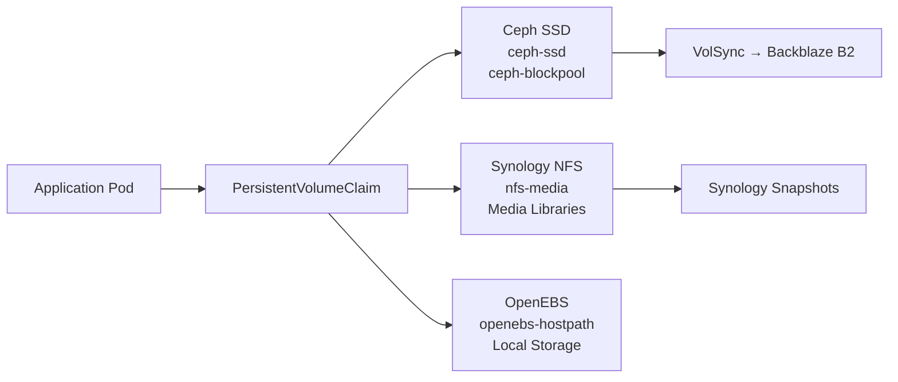

# Storage & Data Management

The cluster uses multiple storage backends depending on the use case: local ephemeral storage, distributed block storage, shared filesystems, and network file shares.

## Storage Classes

Different apps need different types of storage. The cluster provides three storage classes:

| Storage Class | Backend | Use Case | Performance | Redundancy |
|---------------|---------|----------|-------------|------------|
| `ceph-ssd` (default) | Rook-Ceph | Persistent block storage | Medium | 3x replication |
| `openebs-hostpath` | OpenEBS | Local storage (CNPG, ephemeral) | Fast | None (local disk) |
| `nfs-media` | NFS Server | Media libraries | Varies | External |

### Storage Decision Matrix



| App Type | Storage Class | Reason |
|----------|--------------|---------|
| **Databases** (PostgreSQL via CNPG) | `openebs-hostpath` | CNPG manages replication, prefers local fast storage |
| **Config & app state** | `ceph-ssd` | Critical persistent data, survives node failure |
| **Media libraries** (Plex, Jellyfin) | `nfs-media` | Large capacity from Synology NAS |
| **Cache** (Victoria Logs, temp data) | `openebs-hostpath` | Fast local storage, ephemeral |

### When to Use Each

=== "openebs-hostpath"
    **Use for**: Cache, temporary data, non-critical state

    Data lives on a single node's local disk. If the node dies, data is lost. Fast, but not persistent.

    ```yaml
    apiVersion: v1
    kind: PersistentVolumeClaim
    metadata:
      name: cache
    spec:
      storageClassName: openebs-hostpath
      accessModes: [ReadWriteOnce]
      resources:
        requests:
          storage: 10Gi
    ```

=== "ceph-ssd"
    **Use for**: Databases, application state, anything critical

    Block storage replicated across 3 nodes via Rook-Ceph. Data survives node failures. This is the default for most apps.

    ```yaml
    apiVersion: v1
    kind: PersistentVolumeClaim
    metadata:
      name: postgres-data
    spec:
      storageClassName: ceph-ssd
      accessModes: [ReadWriteOnce]
      resources:
        requests:
          storage: 100Gi
    ```

=== "nfs-media"
    **Use for**: Large media libraries (movies, photos, etc.)

    Network file share from an external NAS. Large capacity but slower than local storage.

    ```yaml
    apiVersion: v1
    kind: PersistentVolumeClaim
    metadata:
      name: media-library
    spec:
      storageClassName: nfs-media
      accessModes: [ReadWriteMany]
      resources:
        requests:
          storage: 1Ti
    ```

??? tip "How to Choose"
    - **Can you afford to lose this data?** → `openebs-hostpath`
    - **Is it critical persistent data?** → `ceph-ssd`
    - **Database (CNPG manages replication)?** → `openebs-hostpath`
    - **Is it massive media files?** → `nfs-media`

## Rook-Ceph: Distributed Storage

Rook-Ceph provides distributed block storage across cluster nodes. Each node contributes Samsung SSDs for Ceph OSDs over a dedicated 2.5GbE network. See [Infrastructure Architecture](../infrastructure/architecture.md#rook-ceph-distributed-storage) and [Ceph Network](../infrastructure/networking.md#ceph-storage-network) for configuration details.

Ceph replicates data 3x across nodes (host failure domain). Single node failure doesn't impact data availability.

??? example "How Replication Works"
    When you write to a `ceph-ssd` PVC:

    1. Data is written to the primary OSD (Object Storage Daemon) on one node
    2. Ceph replicates it to two other nodes automatically
    3. Write is acknowledged only after replication completes

    If a node fails, Ceph automatically rebalances data to maintain 3 replicas.

### Monitoring Ceph

```bash
# Check Ceph cluster status
kubectl -n rook-ceph exec -it deploy/rook-ceph-tools -- ceph status

# Check OSD status (storage daemons)
kubectl -n rook-ceph exec -it deploy/rook-ceph-tools -- ceph osd status

# Check storage usage
kubectl -n rook-ceph exec -it deploy/rook-ceph-tools -- ceph df

# Access Rook-Ceph dashboard
# URL: https://rook.${SECRET_DOMAIN}
```

## VolSync Backups

VolSync backs up PersistentVolumeClaims to cloud storage (Backblaze B2) using Restic. Apps with critical data include the VolSync component.

### How VolSync Works

The VolSync component ([`kubernetes/components/volsync/`](https://github.com/tscibilia/home-ops/tree/main/kubernetes/components/volsync)) creates:

1. **ReplicationSource**: Snapshots the PVC on a schedule
2. **ReplicationDestination**: Restores from the latest snapshot
3. **ExternalSecret**: Restic repository password and B2 credentials
4. **PVC**: Used for restores

Apps include it in their `ks.yaml`:

```yaml
spec:
  components:
    - ../../../../components/volsync
  postBuild:
    substitute:
      APP: immich
      VOLSYNC_CAPACITY: 100Gi  # Size of the PVC
```

### Backup Schedule

From [`kubernetes/components/volsync/replicationsource.yaml`](https://github.com/tscibilia/home-ops/blob/main/kubernetes/components/volsync/replicationsource.yaml):

```yaml
spec:
  trigger:
    schedule: "0 */12 * * *"  # Every 12 hours
```

Backups run twice daily. Customize per-app by overriding in the app's resources.

### Manual Snapshots

Force a backup immediately:

```bash
# Trigger snapshot for a specific app
just kube snapshot <namespace> <app-name>

# Trigger all snapshots
just kube snapshot-all
```

### Restoring from Backup

To restore an app's data:

1. List available snapshots:

    ```bash
    just kube volsync-list <namespace> <app-name>
    ```

2. Restore from a specific snapshot (e.g., 2nd most recent):

    ```bash
    just kube volsync-restore <namespace> <app-name> 2
    ```

3. The app will restart with data from that snapshot

??? info "How Restore Works"
    The restore process:

    1. Scales down the app (to avoid file conflicts)
    2. Creates a new PVC with `dataSourceRef` pointing to ReplicationDestination
    3. Kubernetes Volume Populator fills the PVC from the backup
    4. App is scaled back up with restored data

    The old PVC is renamed, not deleted, so you can roll back if needed.

### Unlocking Repositories

If Restic repositories get locked (due to interrupted backups):

```bash
just kube volsync-unlock
```

This unlocks all repositories. Safe to run anytime.

## PostgreSQL (CNPG)

CloudNativePG provides HA PostgreSQL clusters. Configured in [`kubernetes/apps/database/cnpg/`](https://github.com/tscibilia/home-ops/tree/main/kubernetes/apps/database/cnpg).

### Current Clusters

- **pgsql-cluster**: Main PostgreSQL 17 cluster for most apps (Authentik, Gatus, etc.)
- **immich17**: PostgreSQL 17 cluster for Immich with vectorchord extension
- Located in `database` namespace
- Storage: `openebs-hostpath` (20Gi per instance, 3 instances)
- Backups: Barman-cloud to Backblaze B2

### Automatic User Provisioning

Apps using PostgreSQL include the CNPG component ([`kubernetes/components/cnpg/`](https://github.com/tscibilia/home-ops/tree/main/kubernetes/components/cnpg)):

```yaml
spec:
  components:
    - ../../../../components/cnpg
  postBuild:
    substitute:
      APP: authentik
      CNPG_NAME: pgsql-cluster
```

This automatically:

1. Creates a database user named `authentik`
2. Creates a database named `authentik`
3. Generates a Kubernetes Secret with:
    - `username`
    - `password`
    - `uri` (connection string)

The app references this secret in its Helm values:

```yaml
envFrom:
  - secretRef:
      name: authentik-pguser-secret
```

### CNPG Backups

CNPG includes built-in backup via `pg_basebackup` to S3-compatible storage. Defined in the Cluster CRD.

To manually trigger a backup:

```bash
kubectl cnpg backup <cluster-name> -n database
```

To restore:

```bash
kubectl cnpg restore <cluster-name> --backup <backup-name> -n database
```

### PostgreSQL 17 Upgrade

The cluster was upgraded from PostgreSQL 16 to PostgreSQL 17 in December 2024. Key changes:

- **Cluster name**: `pgsql-cluster` (running PostgreSQL 17)
- **Image**: `ghcr.io/cloudnative-pg/postgresql:17`
- **Migration approach**: Blue-green migration pattern with restoration from backups
- **Located in**: [`kubernetes/apps/database/cnpg/pgsql-cluster/`](https://github.com/tscibilia/home-ops/tree/main/kubernetes/apps/database/cnpg/pgsql-cluster)

The immich17 cluster is a separate PostgreSQL 17 instance for Immich-specific database requirements.

For detailed migration procedures, see [Issue #1211](https://github.com/tscibilia/home-ops/issues/1211).

## Dragonfly: Redis Cache

Dragonfly is a Redis-compatible in-memory cache. Deployed in [`kubernetes/apps/database/dragonfly/`](https://github.com/tscibilia/home-ops/tree/main/kubernetes/apps/database/dragonfly).

Apps connect to it via:

```
dragonfly-cluster.database.svc.cluster.local:6379
```

### Database Indices

Multiple apps share the same Dragonfly instance but use different database indices:

- **DB 0**: Default
- **DB 1**: Authentik (unused as of [Authentik 2025.10](https://goauthentik.io/blog/2025-11-13-we-removed-redis/) which removed Redis support)
- **DB 2**: Immich
- **DB 3**: Searxng

This prevents key collisions between apps.

## Storage Operations

### Browsing PVC Contents

To inspect what's inside a PVC:

```bash
just kube browse-pvc <namespace> <claim-name>
```

This mounts the PVC to a debug pod and drops you into a shell. Useful for diagnosing storage issues.

### Checking PVC Usage

```bash
# List all PVCs
kubectl get pvc -A

# Show PVC details (including size and usage)
kubectl describe pvc <claim-name> -n <namespace>

# Check actual disk usage from inside a pod
kubectl exec -it <pod-name> -n <namespace> -- df -h
```

### Expanding a PVC

To increase a PVC's size:

1. Edit the Helm values or PVC manifest to increase `storage`
2. Apply the changes via Git
3. Kubernetes automatically expands the volume (if the StorageClass supports it)

Most storage classes (`ceph-ssd`, `cephfs`) support expansion. `openebs-hostpath` does not.

### Deleting a PVC

Deleting a PVC deletes the underlying data! Always make sure you have backups.

```bash
# Scale down the app first
kubectl scale deployment <app> --replicas=0 -n <namespace>

# Delete the PVC
kubectl delete pvc <claim-name> -n <namespace>

# Scale the app back up
kubectl scale deployment <app> --replicas=1 -n <namespace>
```

The app will recreate the PVC on startup if it's defined in the Helm chart.

## Disaster Recovery

### Full Backup Strategy

1. **Application data**: VolSync backs up PVCs to Backblaze B2
2. **Database dumps**: CNPG backs up PostgreSQL to S3
3. **Configuration**: Git (this repository) is the source of truth
4. **Secrets**: Stored in aKeyless (cloud secrets manager)

To restore the entire cluster:

1. Rebuild the cluster: `just bootstrap default`
2. Restore application data: `just kube volsync-restore <namespace> <app> 1`
3. Restore databases: `kubectl cnpg restore ...`

### Testing Restores

Regularly test restores to ensure backups work:

1. Spin up a test namespace
2. Restore VolSync backups into test PVCs
3. Verify data integrity

## Next Steps

- [Operations Guide](../operations/overview.md): Day-to-day maintenance
- [Troubleshooting](../operations/troubleshooting.md): Common storage issues
