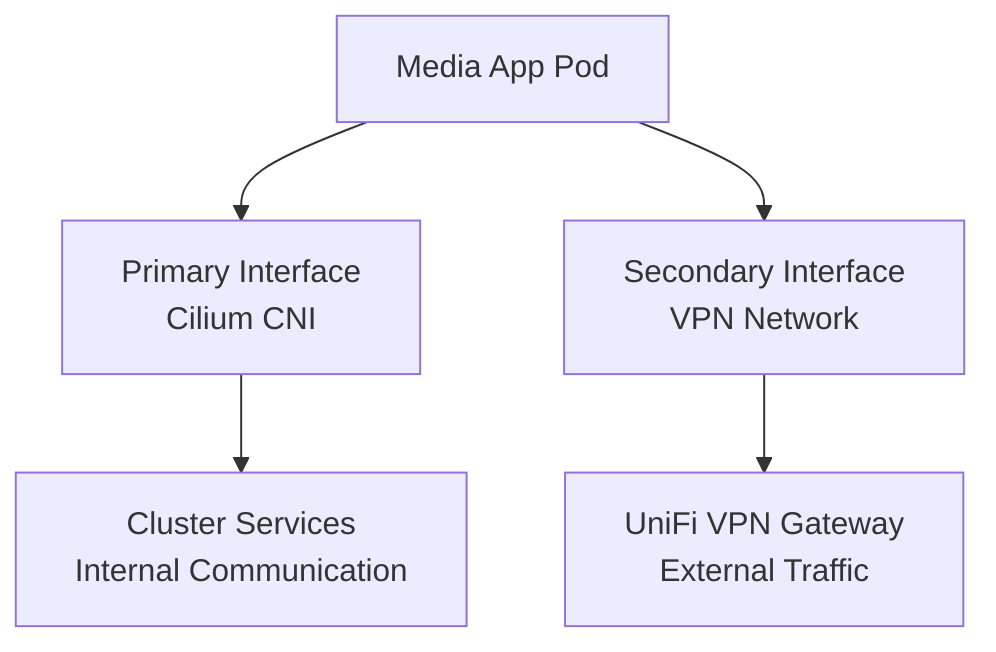

# VPN Networking with Multus

Select applications require VPN routing for external traffic while maintaining internal cluster connectivity. This is achieved using Multus CNI to attach secondary network interfaces.

## Overview



## Use Cases

Applications that use VPN networking:

- **qBittorrent**: Download traffic routed through VPN for privacy
- **Prowlarr**: Indexer traffic routed through VPN

## How It Works

Multus CNI allows pods to have multiple network interfaces. The cluster uses this to provide:

1. **Primary interface (eth0)**: Cilium-managed network for cluster communication
   - DNS resolution
   - Service discovery
   - Internal API calls

2. **Secondary interface (net1)**: VPN network for external traffic
   - Routes traffic through UniFi VPN gateway
   - Isolated from cluster network
   - Dedicated for download/indexer traffic

## Configuration

### NetworkAttachmentDefinition

Defines the secondary VPN network:

```yaml
apiVersion: k8s.cni.cncf.io/v1
kind: NetworkAttachmentDefinition
metadata:
  name: unifi-vpn
  namespace: media
spec:
  config: |
    {
      "cniVersion": "0.3.1",
      "type": "macvlan",
      "master": "eth0",
      "mode": "bridge",
      "ipam": {
        "type": "static",
        "addresses": [
          {
            "address": "10.10.20.x/24",
            "gateway": "10.10.20.1"
          }
        ]
      }
    }
```

### Pod Annotation

Apps using the VPN network add the Multus annotation to their pod spec:

```yaml
apiVersion: v1
kind: Pod
metadata:
  name: qbittorrent
  annotations:
    k8s.v1.cni.cncf.io/networks: unifi-vpn
spec:
  containers:
    - name: app
      image: ghcr.io/onedr0p/qbittorrent
```

When the pod starts, Multus attaches both the primary Cilium interface and the secondary VPN interface.

## Examples

### qBittorrent Configuration

Located in [`kubernetes/apps/media/qbittorrent/`](https://github.com/tscibilia/home-ops/tree/main/kubernetes/apps/media/qbittorrent):

- Uses Multus to attach VPN network
- Download traffic routes through VPN
- Internal cluster services (Prometheus metrics, etc.) use primary interface

### Prowlarr Configuration

Located in [`kubernetes/apps/media/prowlarr/`](https://github.com/tscibilia/home-ops/tree/main/kubernetes/apps/media/prowlarr):

- Uses Multus to attach VPN network
- Indexer queries route through VPN
- Communication with Sonarr/Radarr uses primary interface

## Troubleshooting

### Check Network Interfaces

Verify the pod has both interfaces:

```bash
kubectl exec -it <pod-name> -n media -- ip addr show
```

Expected output:
```
1: lo: <LOOPBACK,UP,LOWER_UP>
2: eth0@if123: <BROADCAST,MULTICAST,UP,LOWER_UP>  # Primary (Cilium)
3: net1@if456: <BROADCAST,MULTICAST,UP,LOWER_UP>  # Secondary (VPN)
```

### Verify Routing

Check routing table:

```bash
kubectl exec -it <pod-name> -n media -- ip route show
```

External traffic should route through the VPN gateway (10.10.20.1).

### Test VPN Connectivity

```bash
# Ping VPN gateway
kubectl exec -it <pod-name> -n media -- ping 10.10.20.1

# Check external IP (should show VPN endpoint)
kubectl exec -it <pod-name> -n media -- curl ifconfig.me
```

### Common Issues

**Pod fails to start with "failed to attach network"**:
- Verify NetworkAttachmentDefinition exists: `kubectl get network-attachment-definitions -n media`
- Check that the annotation references the correct NetworkAttachmentDefinition name

**VPN traffic not routing correctly**:
- Verify routes in pod: `kubectl exec -it <pod-name> -n media -- ip route show`
- Check VPN gateway is reachable: `kubectl exec -it <pod-name> -n media -- ping 10.10.20.1`
- Verify firewall rules on UniFi gateway

**Cluster services not reachable**:
- Ensure primary interface (eth0) is up: `kubectl exec -it <pod-name> -n media -- ip link show eth0`
- Check DNS resolution: `kubectl exec -it <pod-name> -n media -- nslookup kubernetes.default.svc.cluster.local`

## Benefits

- **Traffic isolation**: Download traffic is isolated from cluster traffic
- **No sidecar overhead**: Uses native Kubernetes networking instead of sidecar containers
- **Flexibility**: Apps can selectively route traffic based on destination
- **Simplified configuration**: No need for complex iptables rules or routing policies within the app

## Architecture Comparison

### Before (Sidecar VPN):
```
┌─────────────────┐
│   Pod           │
│ ┌─────────────┐ │
│ │  App        │ │
│ └──────┬──────┘ │
│        │        │
│ ┌──────▼──────┐ │
│ │ VPN Sidecar │ │
│ └──────┬──────┘ │
└────────┼────────┘
         │
    VPN Gateway
```

### After (Multus):
```
┌─────────────────┐
│   Pod           │
│ ┌─────────────┐ │
│ │  App        │ │
│ └──┬────────┬─┘ │
│    │        │   │
│  eth0     net1  │
│    │        │   │
└────┼────────┼───┘
     │        │
  Cluster   VPN
  Network  Gateway
```

## Next Steps

- [Networking Architecture](networking.md): Full cluster networking overview
- [Troubleshooting Guide](../operations/troubleshooting.md): General troubleshooting procedures
