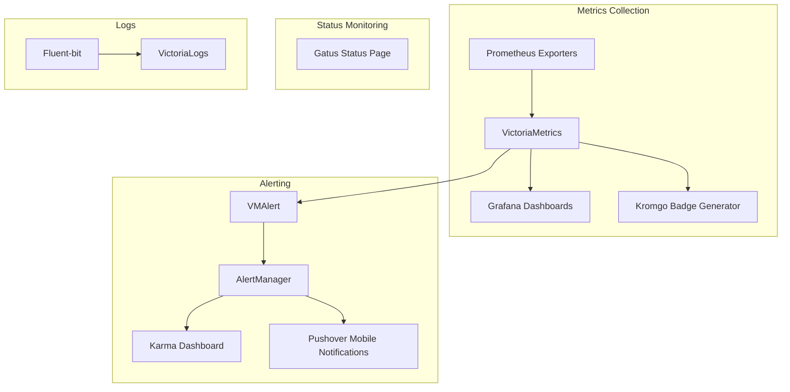

# Observability Guide

The cluster includes a comprehensive observability stack for monitoring, alerting, and log aggregation. Everything runs in the [`observability`](https://github.com/tscibilia/home-ops/tree/main/kubernetes/apps/observability) namespace.

## Observability Stack Overview

The stack is built around **VictoriaMetrics** (Prometheus-compatible metrics), **AlertManager** (alert routing via Karma UI), **Gatus** (status monitoring), and **VictoriaLogs** (log aggregation).



## Web-Accessible Services

| Service | URL | Access | Authentication |
|---------|-----|--------|----------------|
| **Gatus** (Status page) | [status.t0m.co](https://status.t0m.co) | External (public) | None |
| **Karma** (AlertManager UI) | [am.t0m.co](https://am.t0m.co) | Internal only | Authentik SSO |
| **VictoriaMetrics** | [vm.t0m.co](https://vm.t0m.co) | Internal only | Authentik SSO |
| **VictoriaLogs** | [logs.t0m.co](https://logs.t0m.co) | Internal only | Authentik SSO |
| **Grafana** | [grafana.t0m.co](https://grafana.t0m.co) | Internal only | Grafana auth + Authentik SSO |
| **Kromgo** | [kromgo.t0m.co](https://kromgo.t0m.co) | External (public) | None |

??? info "What is 'Internal only'?"
    Services marked "Internal only" use the `envoy-internal` gateway and are only accessible from:
    - Devices on the home network (192.168.5.0/24)
    - Devices connected via Tailscale VPN

    They are **not** exposed through the Cloudflared tunnel and cannot be accessed from the public internet.

---

## Components

### VictoriaMetrics (Metrics)

**Purpose**: Prometheus-compatible metrics collection, storage, and querying

**Components**:
- **vmsingle**: Single-node metrics storage with 6-week retention
- **vmagent**: Scrapes metrics from services and exporters
- **vmalert**: Evaluates Prometheus alert rules
- **kube-state-metrics**: Exports Kubernetes object state as metrics
- **prometheus-node-exporter**: Exports node/system metrics

**Access**: [vm.t0m.co](https://vm.t0m.co) (internal only, Authentik SSO required)

**Storage**: 40Gi on `ceph-ssd` storage class

**Configuration**: [`victoria-metrics/app/helmrelease.yaml`](https://github.com/tscibilia/home-ops/blob/main/kubernetes/apps/observability/victoria-metrics/app/helmrelease.yaml)

??? info "Adding Metrics to an App"
    Apps expose metrics via **ServiceMonitor** resources. VictoriaMetrics automatically discovers and scrapes them:

    ```yaml title="kubernetes/apps/default/myapp/app/helmrelease.yaml"
    serviceMonitor:
      app:
        serviceName: myapp
        endpoints:
          - port: metrics
            path: /metrics
    ```

    VictoriaMetrics Operator converts ServiceMonitors into vmagent scrape configs automatically.

---

### AlertManager + Karma (Alerting)

**Purpose**: Routes alerts from vmalert to notification channels, web UI via Karma

**Important**: AlertManager itself has no web UI exposed. **Karma** provides the web interface to AlertManager.

**Access**: [am.t0m.co](https://am.t0m.co) via Karma (internal only, Authentik SSO required)

**Configured receivers**:
- **Pushover**: Critical and warning alerts to mobile devices
- **Healthchecks.io**: Watchdog heartbeat (confirms monitoring is alive)
- **null**: InfoInhibitor alerts (silenced)

**Alert routing logic**:
1. Group alerts by `alertname` and `job`
2. Wait 1 minute before sending grouped alerts
3. Send to Pushover for `severity=~"warning|critical"`
4. Repeat alerts every 12 hours if not resolved
5. Silence lower-severity alerts when critical alerts are firing

**Karma configuration**: Connects to AlertManager internally at `http://vmalertmanager-stack.observability.svc.cluster.local:9093`

??? example "Pushover Notification Format"
    Alerts are sent to Pushover with:

    - **Title**: `[FIRING:2] KubePodCrashLooping`
    - **Message**: Alert description + labels
    - **Priority**: `1` (firing), `0` (resolved)
    - **Sound**: `gamelan`
    - **URL**: "View in Alertmanager" (links to Karma)

    Configuration: [`victoria-metrics/app/helmrelease.yaml`](https://github.com/tscibilia/home-ops/blob/main/kubernetes/apps/observability/victoria-metrics/app/helmrelease.yaml#L95-L166)

---

### Gatus (Status Monitoring)

**Purpose**: Uptime monitoring and public status page

**What it monitors**:
- HTTP/HTTPS endpoints (apps exposed via HTTPRoute)
- Kubernetes Services (via sidecar auto-discovery)
- Custom endpoints (configured manually)

**Access**: [status.t0m.co](https://status.t0m.co) (publicly accessible)

**Auto-discovery**: The [`gatus-sidecar`](https://github.com/home-operations/gatus-sidecar) automatically creates Gatus endpoints for:
- All HTTPRoute resources with `gatus.home-operations.com/enabled: "true"` annotation
- All Service resources with `gatus.home-operations.com/enabled: "true"` annotation

**Storage**: PostgreSQL database (`gatus-pguser` secret managed via CNPG component)

??? example "Adding an App to Status Page"
    Apps are automatically monitored if they have an HTTPRoute. To customize the health check:

    ```yaml title="kubernetes/apps/default/myapp/app/helmrelease.yaml"
    route:
      app:
        annotations:
          gatus.home-operations.com/enabled: "true"  # Enable monitoring
          gatus.home-operations.com/endpoint: |      # Custom health check
            conditions: ["[STATUS] == 200", "[BODY].status == ok"]
            interval: 60s
        hostnames: ["myapp.${SECRET_DOMAIN}"]
    ```

    The sidecar watches HTTPRoute resources and syncs them to Gatus configuration automatically.

---

### VictoriaLogs (Log Aggregation)

**Purpose**: Centralized log storage and search

**Retention**: 21 days

**Access**: [logs.t0m.co](https://logs.t0m.co) (internal only, Authentik SSO required)

**Log sources**:
- All pods via **fluent-bit** DaemonSet
- Kubernetes audit logs
- System logs

**Storage**: 10Gi on `openebs-hostpath`

??? info "Searching Logs"
    VictoriaLogs uses LogsQL query language (similar to LogQL):

    **Search by app**:
    ```logsql
    {namespace="default", app="authentik"}
    ```

    **Search for errors**:
    ```logsql
    {namespace="default"} | "error" or "ERROR"
    ```

    **Time range search**:
    ```logsql
    {namespace="media", app="plex"} [5m]
    ```

    Access the web UI at [logs.t0m.co](https://logs.t0m.co) from the internal network.

---

### Grafana (Dashboards)

**Purpose**: Metrics visualization and dashboarding

**Access**: [grafana.t0m.co](https://grafana.t0m.co) (internal only, Grafana auth + Authentik SSO)

**Dashboards**: Managed declaratively via `GrafanaDashboard` CRDs. Apps include dashboards in their manifests:

```yaml title="Example: kubernetes/apps/network/cilium/app/grafanadashboard.yaml"
apiVersion: grafana.integreatly.org/v1beta1
kind: GrafanaDashboard
metadata:
  name: cilium-operator
spec:
  instanceSelector:
    matchLabels:
      dashboards: grafana
  url: https://raw.githubusercontent.com/cilium/cilium/main/install/kubernetes/cilium/files/cilium-operator/dashboards/cilium-operator-dashboard.json
```

**Datasource**: VictoriaMetrics at `https://vm.${SECRET_DOMAIN}`

??? tip "Creating Custom Dashboards"
    1. Create dashboard in Grafana web UI
    2. Export as JSON
    3. Create GrafanaDashboard CRD:

    ```yaml
    apiVersion: grafana.integreatly.org/v1beta1
    kind: GrafanaDashboard
    metadata:
      name: my-dashboard
      namespace: observability
    spec:
      instanceSelector:
        matchLabels:
          dashboards: grafana
      json: |
        <paste exported JSON>
    ```

    Grafana Operator syncs dashboards automatically.

---

### Kromgo (Badge Generator)

**Purpose**: Generate status badges from Prometheus queries for README files

**Access**: [kromgo.t0m.co](https://kromgo.t0m.co) (publicly accessible)

**Example badges**:
- Cluster uptime
- Pod count
- Storage usage
- Kubernetes version

**How it works**: Kromgo queries VictoriaMetrics internally and renders SVG badges based on configured queries.

**Configuration**: [`kromgo/app/configmap.yaml`](https://github.com/tscibilia/home-ops/blob/main/kubernetes/apps/observability/kromgo/app/configmap.yaml)

---

### Prometheus Exporters

Various exporters provide metrics for infrastructure components:

| Exporter | Purpose | Metrics |
|----------|---------|---------|
| **node-exporter** | System/hardware metrics | CPU, memory, disk, network |
| **kube-state-metrics** | Kubernetes object state | Pods, deployments, nodes |
| **unpoller** | Unifi network stats | WiFi clients, bandwidth, devices |

All exporters are scraped by vmagent automatically via ServiceMonitor CRDs.

---

## Common Observability Tasks

### Viewing Active Alerts

**Via Karma (recommended)**:
1. Navigate to [am.t0m.co](https://am.t0m.co) (requires internal network access)
2. Log in with Authentik SSO
3. View grouped alerts with filters

**Via Pushover**:
- Critical/warning alerts sent to mobile device automatically

### Searching Logs

```bash
# 1. Navigate to VictoriaLogs web UI (internal network only)
open https://logs.t0m.co

# 2. Log in with Authentik SSO

# 3. Use LogsQL to search
# Example: Find all errors in default namespace in last 5 minutes
{namespace="default"} | "error" [5m]

# Example: Search specific app
{namespace="media", app="plex"}

# Example: Search across all namespaces
{} | "connection refused"
```

### Creating Alert Rules

Alert rules are defined as `PrometheusRule` CRDs (converted to VMRule by VictoriaMetrics Operator):

```yaml title="kubernetes/apps/default/myapp/app/prometheusrule.yaml"
apiVersion: monitoring.coreos.com/v1
kind: PrometheusRule
metadata:
  name: myapp
spec:
  groups:
    - name: myapp
      rules:
        - alert: MyAppDown
          annotations:
            summary: MyApp is down
            description: MyApp has been unavailable for 5 minutes
          expr: up{job="myapp"} == 0
          for: 5m
          labels:
            severity: critical
```

**Commit and push**—Flux applies the rule, VMAlert evaluates it, and AlertManager routes firing alerts to Pushover.

### Silencing Alerts

**Temporary silence**:
1. Navigate to [am.t0m.co](https://am.t0m.co) (Karma)
2. Click alert → "Silence"
3. Set duration and reason
4. Create silence

**Permanent silence**:
Add silence to `silence-operator` configuration or adjust alert rule severity/inhibition.

### Checking Status Page

Public status page shows app availability:

1. Navigate to [status.t0m.co](https://status.t0m.co)
2. View real-time status of all monitored endpoints
3. Click endpoint for uptime history

Apps automatically appear if they have an HTTPRoute with Gatus annotation enabled.

---

## Alert Rules

The cluster includes several categories of alert rules:

### Core Kubernetes Alerts

- `KubePodCrashLooping` - Pod crash loops
- `KubePodNotReady` - Pods stuck in non-ready state
- `KubeDeploymentReplicasMismatch` - Deployment replica count issues
- `KubePersistentVolumeFillingUp` - PVC approaching capacity
- `KubeNodeNotReady` - Node in NotReady state
- `KubeAPIErrorBudgetBurn` - Kubernetes API error rate too high

### Application-Specific Alerts

Apps define custom alerts in [`prometheusrule.yaml`](https://github.com/tscibilia/home-ops/tree/main/kubernetes/apps) files:

- **CNPG**: Database cluster health, replication lag
- **Cert-Manager**: Certificate expiration warnings
- **Flux**: GitRepository sync failures, HelmRelease failures
- **Cilium**: Network policy drops, endpoint health
- **VolSync**: Backup failures

### Custom Alerts

Additional alerts defined in VictoriaMetrics HelmRelease:

- `DockerhubRateLimitRisk` - Too many Docker Hub pulls
- `OomKilled` - Pods killed due to OOM
- `KubePodFailed` - Pods in Failed state for >15 minutes

All alerts are viewable in [Karma](https://am.t0m.co).

---

## Metrics Retention and Storage

| Component | Retention | Storage Size | Storage Class |
|-----------|-----------|--------------|---------------|
| **VictoriaMetrics** | 6 weeks | 40Gi | ceph-ssd |
| **VictoriaLogs** | 21 days | 10Gi | openebs-hostpath |
| **Gatus** | Unlimited (PostgreSQL) | Shared CNPG cluster | ceph-ssd |
| **Grafana** | N/A (uses VictoriaMetrics) | Shared CNPG cluster | ceph-ssd |

---

## Troubleshooting Observability

### Alerts Not Firing

**Symptoms**: Expected alert not visible in Karma or Pushover

**Diagnosis**:

```bash
# 1. Check if alert rule exists
kubectl get prometheusrule -A | grep <rule-name>

# 2. Check VMAlert logs
kubectl logs -n observability deployment/vmalert-stack -f

# 3. Query VictoriaMetrics directly to test alert expression
# Navigate to https://vm.t0m.co (internal network)
# Run the alert's PromQL expression manually
```

**Common causes**:
- Alert rule syntax error (check VMAlert logs)
- Alert expression never evaluates to true (test in VictoriaMetrics)
- Alert `for` duration not yet elapsed

### Metrics Missing

**Symptoms**: Grafana dashboard shows "No data" or incomplete metrics

**Diagnosis**:

```bash
# 1. Check if ServiceMonitor exists
kubectl get servicemonitor -n <namespace>

# 2. Check vmagent targets
# Navigate to https://vm.t0m.co/targets (internal network)
# Verify target shows as "UP"

# 3. Check vmagent logs
kubectl logs -n observability deployment/vmagent-stack -f
```

**Common causes**:
- ServiceMonitor not created or misconfigured
- App not exposing `/metrics` endpoint
- Network policy blocking scrape

### Logs Not Appearing

**Symptoms**: VictoriaLogs search returns no results

**Diagnosis**:

```bash
# 1. Check fluent-bit is running on all nodes
kubectl get pods -n observability -l app.kubernetes.io/name=fluent-bit

# 2. Check fluent-bit logs for errors
kubectl logs -n observability daemonset/fluent-bit -f

# 3. Check VictoriaLogs ingestion
kubectl logs -n observability deployment/victoria-logs -f | grep -i error
```

**Common causes**:
- Fluent-bit DaemonSet not running on node
- Pod logs in non-standard location
- VictoriaLogs storage full

### Gatus Status Page Not Updating

**Symptoms**: Status page shows outdated status or missing endpoints

**Diagnosis**:

```bash
# 1. Check gatus-sidecar logs (auto-discovery)
kubectl logs -n observability deployment/gatus -c gatus-sidecar -f

# 2. Check main Gatus container logs
kubectl logs -n observability deployment/gatus -c app -f

# 3. Verify HTTPRoute has correct annotation
kubectl get httproute -n <namespace> <app> -o yaml | grep gatus.home-operations.com
```

**Common causes**:
- Missing `gatus.home-operations.com/enabled: "true"` annotation
- HTTPRoute not created yet
- Gatus database connection issue

---

## Best Practices

1. **Always define alerts for new apps**: Include a `prometheusrule.yaml` for critical failure scenarios
2. **Use Grafana dashboards**: Create dashboards for app-specific metrics
3. **Enable Gatus monitoring**: Add `gatus.home-operations.com/enabled: "true"` to HTTPRoutes
4. **Test alert expressions**: Verify PromQL queries in VictoriaMetrics web UI before committing
5. **Monitor alert noise**: If alerts fire too frequently, adjust thresholds or add inhibition rules
6. **Check logs for errors**: Use VictoriaLogs to investigate alert root causes

---

## Next Steps

- [Troubleshooting Guide](troubleshooting.md): Common cluster issues
- [Task Runner Reference](task-runner.md): Managing apps and resources
- [Operations Overview](overview.md): Day-to-day cluster management
