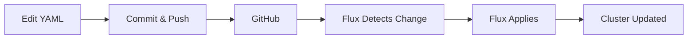

# Operations Overview

Day-to-day operations are GitOps-driven: Renovate opens PRs for updates, Flux applies changes, and alerts notify when intervention is needed. This guide lists the common workflows and commands you’ll use.

## Normal workflow



## Monitoring

- Passive: push notifications on alerts
- Status page: https://status.t0m.co
- AlertManager: https://am.t0m.co (only available w/in home LAN)

Use alerts and the status page as the primary indicators; dig into Grafana/AlertManager when needed.

## Common Tasks

### Updating an Existing App

Most app updates come automatically via Renovate, but sometimes you need to change configuration:

1. Edit the app's Helm values in `kubernetes/apps/<namespace>/<app>/app/helmrelease.yaml`
2. Commit and push
3. Optionally force sync: `just kube ks-reconcile <namespace> <app>`
4. Monitor: `kubectl rollout status deployment/<app> -n <namespace> -w`

??? example "Real Example: Increasing Plex Memory"
    ```bash
    # 1. Edit Helm values
    nano kubernetes/apps/media/plex/app/helmrelease.yaml
    # Change resources.limits.memory: 8Gi

    # 2. Commit and push
    git add kubernetes/apps/media/plex/
    git commit -m "feat(plex): increase memory limit to 8Gi"
    git push

    # 3. Force reconcile (optional, otherwise waits up to 1 hour)
    just kube ks-reconcile media plex

    # 4. Watch rollout
    kubectl rollout status deployment/plex -n media -w
    ```

### Adding a New App

1. Copy an existing app directory as a template:

    ```bash
    cp -r kubernetes/apps/default/vaultwarden kubernetes/apps/default/myapp
    ```

2. Update the files:
    - `ks.yaml`: Change app name, dependencies, substitutions
    - `app/helmrelease.yaml`: Configure chart and values
    - `app/ocirepository.yaml`: Point to correct chart repository
    - `app/externalsecret.yaml`: Add secrets from aKeyless (if needed)
    - `namespace.yaml`: Update namespace (if using a new one)

3. Test locally (optional but recommended):

    ```bash
    just kube apply-ks <namespace> <app>
    ```

4. Commit and push
5. Force reconcile: `just kube ks-reconcile <namespace> <app>`

??? tip "Using Components"
    Most apps need common patterns. Include components in `ks.yaml`:

    - `../../../../components/cnpg` - If app needs PostgreSQL database
    - `../../../../components/ext-auth-external` - If app needs SSO protection
    - `../../../../components/volsync` - If app has data to backup

### Forcing Updates

Sometimes Flux needs a nudge:

```bash
# Force reconcile a specific app
just kube ks-reconcile <namespace> <app>

# Force sync all Kustomizations
just kube sync-all-ks

# Force sync all HelmReleases
just kube sync-all-hr

# Restart failed Kustomizations
just kube ks-restart

# Restart failed HelmReleases
just kube hr-restart
```

### Viewing Secrets

Secrets are base64-encoded in Kubernetes. To decode them:

```bash
just kube view-secret <namespace> <secret-name>
```

This decodes all keys and shows them in plain text.

### Scaling Apps

```bash
# Scale up/down manually
kubectl scale deployment/<app> --replicas=3 -n <namespace>

# Or edit the Helm values and let Flux apply it
```

For apps with KEDA auto-scaling, you can suspend/resume:

```bash
# Suspend auto-scaling for one app
just kube keda suspend <namespace> <app>

# Resume auto-scaling
just kube keda resume <namespace> <app>

# Suspend/resume all
just kube keda-all suspend
just kube keda-all resume
```

## Backup & Restore

VolSync handles PVC snapshots (default: every 6h). Useful commands:

```bash
just kube snapshot <ns> <app>      # snapshot one app
just kube snapshot-all             # snapshot all
just kube volsync-list <ns> <app>  # list snapshots
just kube volsync-restore <ns> <app> <n> # restore (1 = latest)
```

Postgres (CNPG) backups to S3(minio) are automatic. Useful commands:

```bash
kubectl cnpg backup pgsql-cluster -n database
kubectl cnpg restore pgsql-cluster --backup <name> -n database
```

## System Upgrades (Talos & Kubernetes)

Upgrades are automated by `tuppr` via Renovate PRs (Talos → Kubernetes). Typical flow:

1. Renovate opens PRs for tool and platform versions
2. Merge tool updates (`.mise.toml`) first
3. Merge tuppr/Talos PRs; tuppr performs rolling upgrades and health checks

Manual fallback:

```bash
# Upgrade Kubernetes manually
just talos upgrade-k8s 1.35.0

# Upgrade Talos on a single node
just talos upgrade-node talos-m01
```

tuppr can also **downgrade** if needed—just update the version in the TalosUpgrade/KubernetesUpgrade CRD to an earlier version and commit it.

## Node Maintenance

### Rebooting Nodes

For manual reboots (not upgrades), reboot one at a time:

```bash
just talos reboot-node talos-m01
kubectl wait --for=condition=ready node/talos-m01 --timeout=10m

just talos reboot-node talos-m02
kubectl wait --for=condition=ready node/talos-m02 --timeout=10m

just talos reboot-node talos-m03
kubectl wait --for=condition=ready node/talos-m03 --timeout=10m
```

Kubernetes reschedules pods to healthy nodes during reboots automatically.

## Observability

### Dashboards

- **Grafana**: [https://grafana.t0m.co](https://grafana.t0m.co) - Metrics and dashboards
- **VictoriaMetrics**: Metrics database (queried via Grafana)
- **VictoriaLogs**: [https://logs.t0m.co](https://logs.t0m.co) - Log search GUI (internal network only)
- **AlertManager**: [https://am.t0m.co](https://am.t0m.co) - Active alerts
- **Karma**: [https://karma.t0m.co](https://karma.t0m.co) - AlertManager UI with silencing
- **Gatus**: [https://status.t0m.co](https://status.t0m.co) - Service status page

### Checking Logs

**GUI:**

- VictoriaLogs at [https://logs.t0m.co](https://logs.t0m.co) provides a searchable interface for all cluster logs (accessible from internal network only)

**CLI:**

```bash
# View logs from a deployment
kubectl logs -n <namespace> deployment/<app> --tail=100 -f

# View logs from a specific pod
kubectl logs -n <namespace> <pod-name> -f

# View previous crash logs
kubectl logs -n <namespace> <pod-name> --previous

# View logs from all containers in a pod
kubectl logs -n <namespace> <pod-name> --all-containers
```

### Checking Events

Events show what Kubernetes is doing:

```bash
# Recent cluster-wide events
kubectl get events -A --sort-by='.lastTimestamp' | tail -20

# Events for a specific namespace
kubectl get events -n <namespace> --sort-by='.lastTimestamp'

# Events for a specific resource
kubectl get events -n <namespace> --field-selector involvedObject.name=<pod-name>
```

## GitOps Workflows

### Renovate Auto-Updates

Renovate runs hourly via GitHub Actions and creates PRs for:

- Container image updates
- Helm chart updates
- Talos/Kubernetes versions (via tuppr)
- CLI tool versions (in `.mise.toml`)
- GitHub Actions versions

**Auto-merge behavior** (configured in [`.renovate/autoMerge.json5`](https://github.com/tscibilia/home-ops/blob/main/.renovate/autoMerge.json5)):

- **Auto-merged:**
    - Container digest updates for trusted packages
    - Minor/patch updates for specific OCI charts (kube-prometheus-stack, grafana)
    - GitHub Actions updates for trusted actions (actions/*, renovatebot/*)
    - Minor/patch updates for specific GitHub releases (external-dns, gateway-api, prometheus-operator)

- **Manual review required:**
    - Major version updates
    - Most application updates
    - Talos/Kubernetes upgrades

Check open PRs: [https://github.com/tscibilia/home-ops/pulls](https://github.com/tscibilia/home-ops/pulls)

**Typical PR merge order:**

1. Merge `.mise.toml` tool updates first (so you have compatible `kubectl`/`talosctl`)
2. Merge Talos upgrade PR (tuppr handles the rollout)
3. Merge Kubernetes upgrade PR (tuppr handles the rollout)
4. Merge app updates

### Manual Dependency Updates

To update a chart version manually:

```yaml title="kubernetes/apps/default/myapp/ks.yaml"
postBuild:
  substitute:
    MYAPP_VERSION: "2.1.0"  # Change version here
```

Renovate watches these substitution values and updates them automatically via annotations:

```yaml
# renovate: datasource=docker depName=ghcr.io/user/image
MYAPP_VERSION: "2.1.0"
```

## Emergency Procedures

### Suspend Flux (Stop All Automation)

If something's going wrong and you need to stop Flux from making changes:

```bash
flux suspend kustomization --all
```

Resume when ready:

```bash
flux resume kustomization --all
```

### Rollback a Broken Change

```bash
# Revert the Git commit
git revert HEAD
git push

# Force Flux to sync
just kube ks-reconcile <namespace> <app>
```

Flux applies the revert, rolling back to the previous working state.

### Cluster-Wide Restart

If the cluster is in a weird state:

```bash
# Restart all nodes (one at a time)
just talos reboot-node talos-m01
kubectl wait --for=condition=ready node/talos-m01 --timeout=10m

just talos reboot-node talos-m02
kubectl wait --for=condition=ready node/talos-m02 --timeout=10m

just talos reboot-node talos-m03
kubectl wait --for=condition=ready node/talos-m03 --timeout=10m
```

## Best Practices

1. **Always commit changes to Git** - Don't `kubectl edit` manually unless debugging
2. **Test locally with `just kube apply-ks`** before pushing to Git
3. **Watch rollouts** after changes (`kubectl rollout status`)
4. **Trust the self-healing** - Don't intervene unless alerts fire
5. **Merge mise PRs first** - Keep your local tools compatible with the cluster
6. **tuppr handles upgrades** - Don't manually upgrade Talos/Kubernetes unless needed
7. **One node at a time** - Never reboot multiple control plane nodes simultaneously
8. **Check dependencies** - If an app won't deploy, check `dependsOn` resources are healthy

## Next Steps

- [Troubleshooting Guide](troubleshooting.md): When things go wrong
- [Task Runner Reference](task-runner.md): Full command reference
