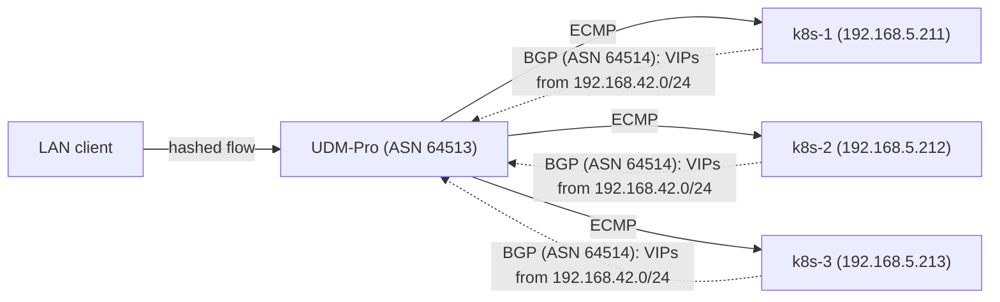
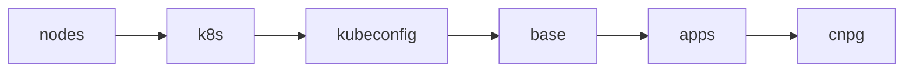

# Bootstrap

Everything needed to take freshly installed Talos nodes to a cluster that Flux
manages on its own. The entire process is driven by a single command:

```sh
just bootstrap cluster
```

Once it completes, Flux reconciles the rest of the repository and this
directory is not used again until the next rebuild.

## Prerequisites

- Tools pinned in [`.mise.toml`](../../.mise.toml) installed via `mise install`
  (talosctl, just, minijinja-cli, helmfile, kustomize, kubectl, yq, jq, gum),
  plus the aKeyless CLI (`akeyless`) on the PATH (not pinned here).
- A signed-in aKeyless CLI (`akeyless`). Machine secrets never live in this
  repo; every `ak://` reference in the Talos configs and bootstrap manifests
  is resolved at apply time by `just template` (minijinja-cli piped through
  [`scripts/akeyless-inject.sh`](scripts/akeyless-inject.sh)).
- A valid `talosconfig` at the repo root (mise points `TALOSCONFIG` there).
  The justfile derives the controller endpoints and node list from
  `talosctl config info`, so nothing is hardcoded here.
- Backblaze B2 credentials for CNPG database recovery (barman-cloud). Only
  needed when restoring the databases during a rebuild — see the
  [cnpg](cnpg/) overlay.

## Networking / BGP

The Kubernetes API is fronted by a Cilium LoadBalancer Service (`kube-api`,
`192.168.42.50`, `externalTrafficPolicy: Local` so only nodes with a healthy
apiserver attract traffic). Cilium announces it to the UDM-Pro over eBGP
(ASN 64514 → 64513) along with every other LoadBalancer IP, from the
`192.168.42.0/24` pool advertised as `/32` host routes with ECMP across the
three control-plane nodes. See
[networking.yaml](../../apps/kube-system/cilium/config/networking.yaml).



| VIP             | Hostname       | Backs                          |
| --------------- | -------------- | ------------------------------ |
| `192.168.42.50` | `k8s.internal` | `kube-api` Service (apiserver) |

A static A record in UniFi points the API hostname at the VIP:

```text
k8s.internal → 192.168.42.50
```

Cilium (ASN 64514) peers from the control-plane node IPs on the LAN subnet
(`192.168.5.211-213`) and announces LoadBalancer Service IPs from the
`192.168.42.0/24` pool. UniFi accepts a single FRR config upload per device
(Settings → Routing → BGP):

<details>
<summary>FRR config</summary>

```text
router bgp 64513
  bgp router-id 192.168.5.1
  no bgp ebgp-requires-policy

  neighbor k8s peer-group
  neighbor k8s remote-as 64514

  neighbor 192.168.5.211 peer-group k8s
  neighbor 192.168.5.212 peer-group k8s
  neighbor 192.168.5.213 peer-group k8s

  address-family ipv4 unicast
    maximum-paths 3
    neighbor k8s next-hop-self
    neighbor k8s soft-reconfiguration inbound
  exit-address-family
exit
```

</details>

`maximum-paths 3` gives true ECMP across the control-plane nodes for the
`kube-api` VIP (FRR's eBGP default is a single best path).

> [!WARNING]
> Re-uploading the FRR config briefly bounces established BGP sessions.

To verify: `vtysh -c "show bgp summary"` on the UDM-Pro, `192.168.42.50/32`
showing an ECMP path per healthy apiserver in `vtysh -c "show ip route"`,
and `curl -k https://k8s.internal:6443/healthz` (expect `401`: the apiserver
demands auth for health endpoints, so _any_ HTTP response proves the path is
up — a connection failure means it is not).

> [!NOTE]
> `k8s.internal` rides the Cilium `kube-api` LoadBalancer, so the named API
> endpoint depends on Cilium being healthy. If the CNI is ever down, reach
> the API directly at `https://192.168.5.211-213:6443` and the Talos API at
> the same node addresses; neither depends on the CNI.

## Stages

`just bootstrap cluster` runs these stages in order (see
[mod.just](mod.just)):



1. **nodes** - Renders each node's Talos config (`talos/*.j2` templates plus
   aKeyless injection) and applies it with `talosctl apply-config --insecure`.
   Nodes that are already configured are skipped, so the stage is idempotent.
2. **k8s** - Runs `talosctl bootstrap` against the controller, retrying until
   etcd reports the cluster already exists.
3. **kubeconfig** - Fetches the kubeconfig with `talosctl kubeconfig`, then
   rewrites the server address to the controller's node IP: the generated
   `https://k8s.internal:6443` points at the Cilium VIP, which does not
   exist yet. The final stage re-fetches the kubeconfig so the endpoint
   returns to `k8s.internal` once Cilium is serving it.
4. **base** - Waits for nodes to register (`nodes-ready`; they stay
   `Ready=False` until the CNI is installed), then applies:
    - **namespaces** - Namespace objects extracted from each app
      Kustomization under `kubernetes/apps/`.
    - **resources** - [`kustomize/resources.yaml.j2`](kustomize/resources.yaml.j2)
      rendered through `just template` (minijinja-cli + aKeyless inject): the
      aKeyless bootstrap Secret, the Cloudflare tunnel credentials, and the
      `cluster-secrets` Secret. These exist before their controllers so
      nothing deadlocks on a missing Secret.
    - **crds** - [`helmfile/crds.yaml`](helmfile/crds.yaml): CRDs extracted
      from upstream charts (external-dns, envoy-gateway, grafana-operator,
      kube-prometheus-stack) and applied directly. Installing CRDs
      out-of-band means Flux Kustomizations that consume CRD-backed resources
      don't need `dependsOn` chains.
5. **apps** - `helmfile sync` of [`helmfile/apps.yaml`](helmfile/apps.yaml),
   the minimal release chain Flux needs before it can take over:

    cilium → coredns → spegel → cert-manager → external-secrets →
    flux-operator → flux-instance → cnpg

    Once `flux-instance` is healthy, Flux reconciles `kubernetes/` and manages
    these same releases from then on.

6. **cnpg** - Creates the CNPG clusters (`pgsql-cluster`,
   `pgvector-cluster`) with `bootstrap.recovery` from Barman backups when
   they exist. Cluster creation intentionally fails when no backups exist,
   letting Flux create fresh clusters normally.

> [!TIP]
> Every stage is safe to re-run. If bootstrap fails partway, fix the issue
> and run `just bootstrap cluster` again.

## Data restore (Kopiur)

Bootstrap itself restores no application data; that happens declaratively
once Flux takes over, via [Kopiur](https://github.com/home-operations/kopiur)
(deployed from [kubernetes/apps/kopiur-system/](../../apps/kopiur-system/),
backed by the `nas` ClusterRepository: kopia on NFS at
`clonenas.internal:/mnt/vault/backups/kubernetes/kopiur`, rclone-synced to
Backblaze B2).

Apps that opt into the `kopiur/backup` component get a PVC whose
`spec.dataSourceRef` points at a Kopiur `Restore` with `target.populator: {}`
(see [kubernetes/components/kopiur/backup/](../../components/kopiur/backup/)).
That makes the `Restore` a passive volume-populator source: when Flux applies
the app on a fresh cluster, the PVC is provisioned by restoring the latest
snapshot for the app's SnapshotPolicy from the repository. The PVC stays
unbound while the restore mover Job runs, so the app's pod simply stays
`Pending` until the data is back; no ordering logic needed anywhere.

Because the `Restore`s use `onMissingSnapshot: Continue`, an app with no
snapshot yet (a brand-new app, or a deliberately fresh start) comes up with
an empty volume instead of failing; the same manifests handle first deploy
and disaster recovery ("deploy-or-restore").

Each `Restore` pins the snapshot it resolved on first reconciliation and
never silently retargets, even if a schedule fires mid-restore. Expect pods
to sit `Pending` for as long as their volume takes to restore.

To manually restore an app to an older snapshot, edit its `Restore` CR (named
`${APP}` in the app namespace) and set `spec.offset` to the number of
snapshots back (`0` = latest), then delete and recreate the pod to mount the
re-populated PVC.

## Single source of truth

The helmfiles define no chart versions or values of their own. Each release's
chart and version are read from the app's `ocirepository.yaml` and its values
from the app's `helmrelease.yaml` under `kubernetes/apps/` (see
[helmfile/templates/](helmfile/templates/)). Bootstrap therefore installs
exactly what Flux will later reconcile, and Renovate updates only one place.

The one exception is `external-dns`: its OCIRepository points at a private
chart `ocharted` proxy which wont resolve due to a race condition, so the
bootstrap CRD source in `helmfile/crds.yaml` is pinned to the public
`ghcr.io/home-operations/charts-mirror/external-dns` instead.
