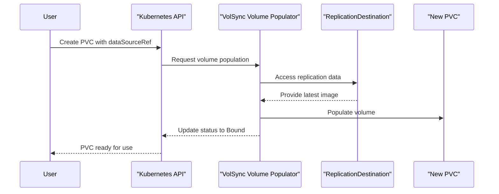
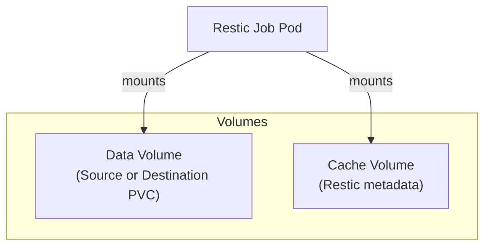
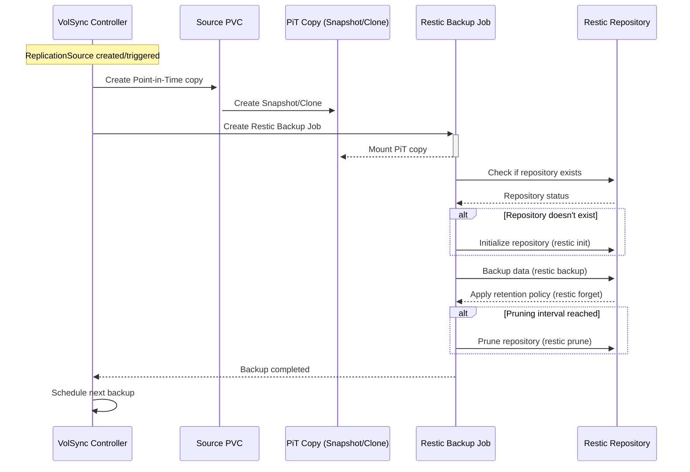
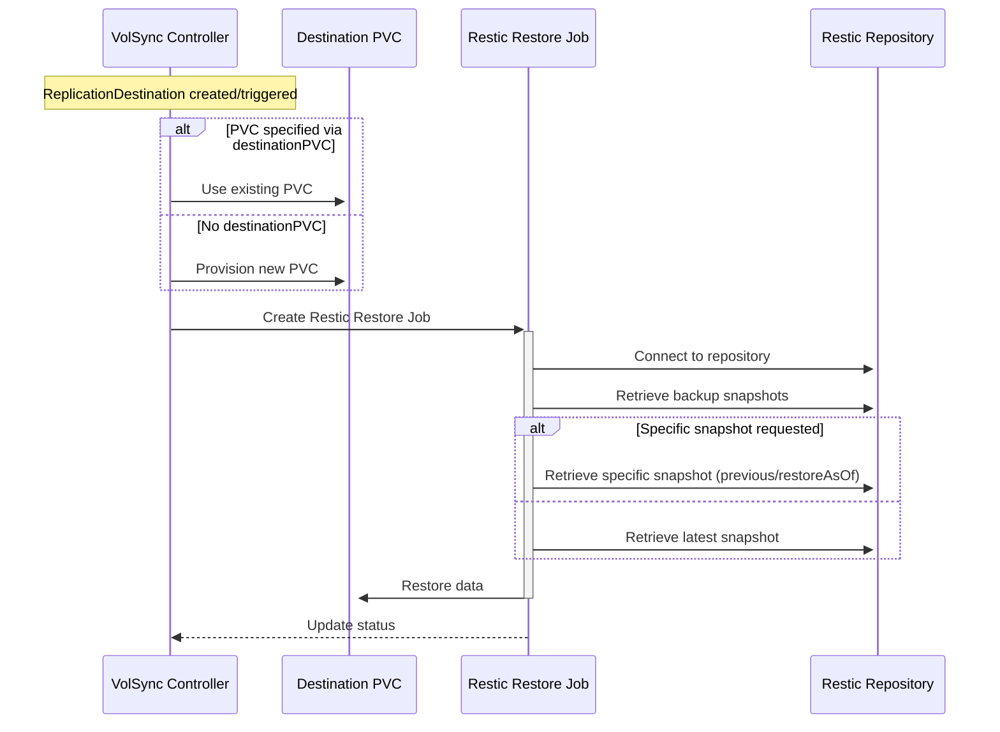

# VolSync Template

## Flux Kustomization
This requires `postBuild` configured on the Flux Kustomization

```yaml
apiVersion: kustomize.toolkit.fluxcd.io/v1
kind: Kustomization
metadata:
  name: &app home-assistant
  namespace: flux-system
spec:
  ...
  postBuild:
    substitute:
      APP: *app
      VOLSYNC_CAPACITY: 1Gi
  ...
```

## Required `postBuild` vars:
- `APP`: The application name
- `VOLSYNC_CAPACITY`: The PVC size

## Optional `postBuild` vars:
- `VOLSYNC_CLAIM`: Alternate PVC instead of `APP`
- `VOLSYNC_PUID`: The value for runAsUser in the mover
- `VOLSYNC_PGID`: The value for runAsGroup and fsGroup in the mover

<br>

# VolSync References and Process
- https://github.com/backube/volsync/blob/42a94491/docs/usage/restic/index.rst

## Volume Populator
The Volume Populator connects the Kubernetes volume population mechanism with VolSync's replication system. It registers a custom populator that handles the creation of PVCs that reference a ReplicationDestination as their data source.


## Cache Volume
The cache significantly improves performance by avoiding downloading repository metadata repeatedly. The size of this cache volume can be controlled via `cacheCapacity` parameter.


## Backup process (ReplicationSource)
The backup schedule should be defined in the `replicationsource.yaml` which will automatically schedule a `Job` as needed.


## Restore Process (ReplicationDestination)
The restore process can be triggered manually to a PITR in case of a single pod data failure, or automatically if the `ReplicationDestination` has a data backup for a new pod being created with the same PVC.
